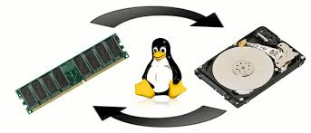
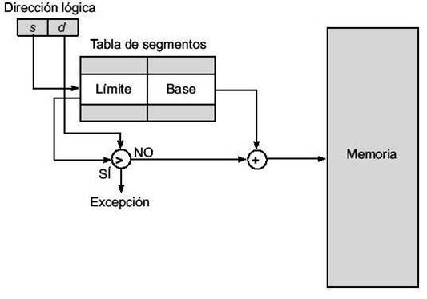
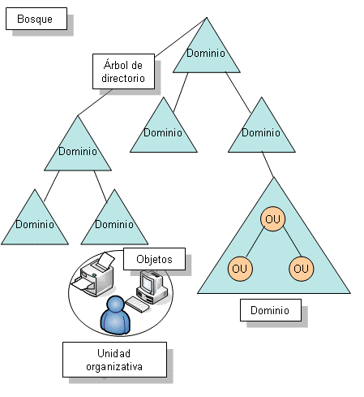
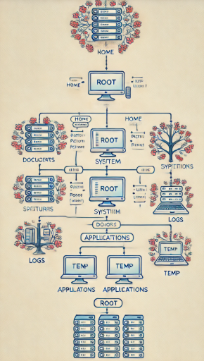
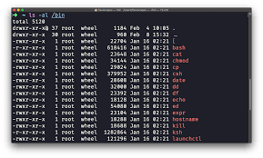

# **Actividades Sistemas Operativos-Edgar Omar García Pardo**
## *Administración de memoria*

### 3.1 Política y Filosofía 
#### 1. ¿Cuál es la diferencia entre fragmentación interna y externa? Explica cómo cada una afecta el rendimiento de la memoria. 

-**Fragmentación Interna:**
Ocurre cuando se asigna un bloque de memoria más grande del necesario a un proceso, dejando espacio sin usar dentro del bloque asignado. Este espacio "sobrante" no se puede aprovechar para otros procesos.

-**Fragmentación Externa:**
 Ocurre cuando hay suficiente memoria libre en total, pero está dividida en bloques no contiguos, lo que impide satisfacer la solicitud de un proceso que requiere un bloque continuo de mayor tamaño.

+ **Impacto General en el Rendimiento de Memoria:**

-**Fragmentación Interna:** Aumenta el desperdicio dentro de bloques asignados, lo que reduce la memoria utilizable, incluso si parece haber suficiente espacio.

-**Fragmentación Externa:** Genera problemas para satisfacer solicitudes de memoria grandes, provocando fallos en la asignación aunque la memoria total sea suficiente.

+ **Tabla comparativa**

|Característica |Fragmentación Interna|Fragmentación Externa|
|-------------- | ------------------|----------------|
|Lugar desperdicio|Dentro de bloques asignados|Fuera de bloques asignados|
|Causa principal|Tamaño fijo de bloques asignados| Bloques libres no contiguos|
|Soluciones| Uso de bloques más pequeños o dinámicos|Compactación o segmentación|

#### 2. Investiga y explica las políticas de reemplazo de páginas en sistemas operativos. ¿Cuál consideras más eficiente y por qué?
-Las políticas de reemplazo de páginas son estrategias utilizadas por los sistemas operativos para decidir qué página de memoria se debe eliminar de la memoria principal (RAM) para dar espacio a una nueva página cuando ocurre un fallo de página (page fault). Estas políticas son esenciales en sistemas que utilizan memoria virtual.

-**FIFO (First-In, First-Out):** Reemplaza la página que llegó primero a la memoria (la más antigua), independientemente de si todavía se utiliza frecuentemente.

-**LRU (Least Recently Used):** Reemplaza la página que no se ha usado durante más tiempo. Se basa en la idea de que las páginas usadas recientemente tienen mayor probabilidad de ser utilizadas pronto.

-**Optimal (OPT):** Reemplaza la página que no se necesitará por el mayor tiempo en el futuro. Es el algoritmo teórico más eficiente.

-**Clock (o Second Chance):** Es una mejora de FIFO. Utiliza un bit de referencia para decidir si una página debe reemplazarse o se le debe dar una "segunda oportunidad".

-**LFU (Least Frequently Used):** Reemplaza la página que se ha utilizado con menor frecuencia. Se basa en la idea de que las páginas poco usadas son menos probables de ser referenciadas de nuevo.

-La política más eficiente en términos teóricos es OPT porque garantiza el menor número de fallos de página. Sin embargo, no se puede implementar en la práctica porque requiere conocimiento futuro del uso de las páginas. En sistemas reales, Clock y LRU suelen ser las más eficientes dependiendo del contexto:

+ Clock: Es una opción eficiente y práctica, con un buen balance entre simplicidad y rendimiento.

+ LRU: Es adecuada cuando se dispone de recursos suficientes para implementar el seguimiento de accesos.

-Por su equilibrio entre eficiencia y viabilidad, Clock es una de las más utilizadas en la práctica.

### 3.2 Memoria real
#### 1. Escribe un programa en C o Python que simule la administración de memoria mediante particiones fijas.

~~~ python
import tkinter as tk
from tkinter import messagebox

class Particion:
    def __init__(self, tamano):
        self.tamano = tamano
        self.ocupada = False
        self.proceso = None

class AdministradorMemoria:
    def __init__(self, memoria_total, num_particiones):
        self.memoria_total = memoria_total
        self.num_particiones = num_particiones
        self.particiones = self.crear_particiones()

    def crear_particiones(self):
        tamano_particion = self.memoria_total // self.num_particiones
        return [Particion(tamano_particion) for _ in range(self.num_particiones)]

    def asignar_proceso(self, id_proceso, tamano_proceso):
        for particion in self.particiones:
            if not particion.ocupada and particion.tamano >= tamano_proceso:
                particion.ocupada = True
                particion.proceso = (id_proceso, tamano_proceso)
                return True
        return False

    def liberar_particion(self, id_proceso):
        for particion in self.particiones:
            if particion.ocupada and particion.proceso[0] == id_proceso:
                particion.ocupada = False
                particion.proceso = None
                return True
        return False

class InterfazMemoria:
    def __init__(self, root, memoria_total, num_particiones):
        self.root = root
        self.administrador = AdministradorMemoria(memoria_total, num_particiones)

        self.root.title("Administrador de Memoria")

        # Marco de entrada
        marco_entrada = tk.Frame(self.root)
        marco_entrada.pack(pady=10)

        tk.Label(marco_entrada, text="ID del Proceso:").grid(row=0, column=0, padx=5, pady=5)
        self.entrada_id_proceso = tk.Entry(marco_entrada)
        self.entrada_id_proceso.grid(row=0, column=1, padx=5, pady=5)

        tk.Label(marco_entrada, text="Tamaño del Proceso:").grid(row=1, column=0, padx=5, pady=5)
        self.entrada_tamano_proceso = tk.Entry(marco_entrada)
        self.entrada_tamano_proceso.grid(row=1, column=1, padx=5, pady=5)

        tk.Button(marco_entrada, text="Asignar", command=self.asignar_proceso).grid(row=2, column=0, padx=5, pady=5)
        tk.Button(marco_entrada, text="Liberar", command=self.liberar_particion).grid(row=2, column=1, padx=5, pady=5)

        # Marco de memoria
        self.marco_memoria = tk.Frame(self.root)
        self.marco_memoria.pack(pady=10)

        self.mostrar_memoria()

    def mostrar_memoria(self):
        for widget in self.marco_memoria.winfo_children():
            widget.destroy()

        tk.Label(self.marco_memoria, text="Estado de la Memoria:").pack()
        for i, particion in enumerate(self.administrador.particiones):
            estado = f"Partición {i + 1}: Libre (Tamaño: {particion.tamano})"
            if particion.ocupada:
                estado = f"Partición {i + 1}: Ocupada por Proceso {particion.proceso[0]} (Tamaño: {particion.proceso[1]})"
            tk.Label(self.marco_memoria, text=estado).pack()

    def asignar_proceso(self):
        id_proceso = self.entrada_id_proceso.get()
        try:
            tamano_proceso = int(self.entrada_tamano_proceso.get())
        except ValueError:
            messagebox.showerror("Error de Entrada", "El tamaño del proceso debe ser un número.")
            return

        if self.administrador.asignar_proceso(id_proceso, tamano_proceso):
            messagebox.showinfo("Éxito", f"Proceso {id_proceso} asignado.")
        else:
            messagebox.showerror("Error de Asignación", f"No se pudo asignar el proceso {id_proceso}.")

        self.mostrar_memoria()

    def liberar_particion(self):
        id_proceso = self.entrada_id_proceso.get()
        if self.administrador.liberar_particion(id_proceso):
            messagebox.showinfo("Éxito", f"Proceso {id_proceso} liberado.")
        else:
            messagebox.showerror("Error de Liberación", f"No se encontró el proceso {id_proceso}.")

        self.mostrar_memoria()

if __name__ == "__main__":
    memoria_total = 1000  # Ejemplo: 1000 unidades de memoria
    num_particiones = 4  # Ejemplo: 4 particiones

    root = tk.Tk()
    app = InterfazMemoria(root, memoria_total, num_particiones)
    root.mainloop()
~~~
#### 2. Diseña un algoritmo para calcular qué procesos pueden ser asignados a un sistema con memoria real limitada utilizando el algoritmo de "primera cabida".
~~~  python
import tkinter as tk
from tkinter import ttk, messagebox

class PrimeraCabidaGUI:
    def __init__(self, root):
        self.root = root
        self.root.title("Algoritmo de Primera Cabida")
        
        # Marcos principales
        self.frame_input = tk.Frame(self.root)
        self.frame_input.pack(pady=10)

        self.frame_result = tk.Frame(self.root)
        self.frame_result.pack(pady=10)

        # Entrada de particiones
        tk.Label(self.frame_input, text="Particiones").grid(row=0, column=0, columnspan=3)
        tk.Label(self.frame_input, text="ID").grid(row=1, column=0)
        tk.Label(self.frame_input, text="Tamaño").grid(row=1, column=1)
        self.particiones_tree = ttk.Treeview(self.frame_input, columns=("ID", "Tamaño"), show="headings")
        self.particiones_tree.heading("ID", text="ID")
        self.particiones_tree.heading("Tamaño", text="Tamaño")
        self.particiones_tree.grid(row=2, column=0, columnspan=3, pady=5)
        
        self.particion_id = tk.Entry(self.frame_input, width=5)
        self.particion_id.grid(row=3, column=0)
        self.particion_tamano = tk.Entry(self.frame_input, width=10)
        self.particion_tamano.grid(row=3, column=1)
        tk.Button(self.frame_input, text="Agregar Partición", command=self.agregar_particion).grid(row=3, column=2)

        # Entrada de procesos
        tk.Label(self.frame_input, text="Procesos").grid(row=4, column=0, columnspan=3)
        tk.Label(self.frame_input, text="ID").grid(row=5, column=0)
        tk.Label(self.frame_input, text="Tamaño").grid(row=5, column=1)
        self.procesos_tree = ttk.Treeview(self.frame_input, columns=("ID", "Tamaño"), show="headings")
        self.procesos_tree.heading("ID", text="ID")
        self.procesos_tree.heading("Tamaño", text="Tamaño")
        self.procesos_tree.grid(row=6, column=0, columnspan=3, pady=5)

        self.proceso_id = tk.Entry(self.frame_input, width=5)
        self.proceso_id.grid(row=7, column=0)
        self.proceso_tamano = tk.Entry(self.frame_input, width=10)
        self.proceso_tamano.grid(row=7, column=1)
        tk.Button(self.frame_input, text="Agregar Proceso", command=self.agregar_proceso).grid(row=7, column=2)

        # Botón para calcular asignación
        tk.Button(self.frame_input, text="Calcular Asignación", command=self.calcular_asignacion).grid(row=8, column=0, columnspan=3, pady=10)

        # Resultados
        tk.Label(self.frame_result, text="Resultados de Asignación").pack()
        self.result_tree = ttk.Treeview(self.frame_result, columns=("Proceso", "Partición"), show="headings")
        self.result_tree.heading("Proceso", text="Proceso")
        self.result_tree.heading("Partición", text="Partición")
        self.result_tree.pack(pady=5)

        tk.Label(self.frame_result, text="Procesos no asignados").pack()
        self.no_asignados_list = tk.Listbox(self.frame_result, height=5)
        self.no_asignados_list.pack(pady=5)

        # Datos
        self.particiones = []
        self.procesos = []

    def agregar_particion(self):
        try:
            id_particion = int(self.particion_id.get())
            tamano_particion = int(self.particion_tamano.get())
            self.particiones.append({'id': id_particion, 'tamano': tamano_particion, 'ocupada': False})
            self.particiones_tree.insert("", "end", values=(id_particion, tamano_particion))
            self.particion_id.delete(0, tk.END)
            self.particion_tamano.delete(0, tk.END)
        except ValueError:
            messagebox.showerror("Error", "Por favor ingrese valores válidos para la partición.")

    def agregar_proceso(self):
        try:
            id_proceso = self.proceso_id.get()
            tamano_proceso = int(self.proceso_tamano.get())
            self.procesos.append({'id': id_proceso, 'tamano': tamano_proceso})
            self.procesos_tree.insert("", "end", values=(id_proceso, tamano_proceso))
            self.proceso_id.delete(0, tk.END)
            self.proceso_tamano.delete(0, tk.END)
        except ValueError:
            messagebox.showerror("Error", "Por favor ingrese valores válidos para el proceso.")

    def calcular_asignacion(self):
        asignaciones = []
        no_asignados = []

        for proceso in self.procesos:
            asignado = False
            for particion in self.particiones:
                if not particion['ocupada'] and particion['tamano'] >= proceso['tamano']:
                    asignaciones.append({'proceso': proceso['id'], 'particion': particion['id']})
                    particion['ocupada'] = True
                    asignado = True
                    break
            if not asignado:
                no_asignados.append(proceso['id'])

        # Mostrar resultados
        for item in self.result_tree.get_children():
            self.result_tree.delete(item)
        for asignacion in asignaciones:
            self.result_tree.insert("", "end", values=(asignacion['proceso'], asignacion['particion']))

        self.no_asignados_list.delete(0, tk.END)
        for proceso in no_asignados:
            self.no_asignados_list.insert(tk.END, proceso)

# Crear la ventana principal
root = tk.Tk()
app = PrimeraCabidaGUI(root)
root.mainloop()
~~~
### 3.3 Organización de memoria virtual
#### 1. Investiga y explica el concepto de "paginación" y "segmentación". ¿Cuáles son las ventajas y desventajas de cada técnica?

- -  **Paginación:**

-La paginación divide tanto la memoria física como la memoria lógica de un proceso en bloques de tamaño fijo.

**➣Características:**

- La memoria lógica (espacio de direcciones del proceso) se divide en bloques llamados páginas.
- La memoria física (RAM) se divide en bloques del mismo tamaño llamados marcos.
- Cada página lógica se asigna a un marco físico de la memoria principal.
- La relación entre páginas y marcos se administra mediante una tabla de páginas.

**➣Ventajas de la Paginación:**

- Elimina la fragmentación externa: Debido al tamaño fijo de las páginas, no hay problemas de bloques contiguos.
- Facilita la administración de memoria: Es más fácil asignar bloques fijos de memoria que bloques variables.
- Soporte para memoria virtual: Permite cargar solo las páginas necesarias en memoria, reduciendo el uso total de RAM.

**➣Desventajas de la Paginación:**

- Genera fragmentación interna: Si el proceso no utiliza completamente una página, el espacio restante se desperdicia.
- Sobrecarga de gestión: Requiere mantener y consultar tablas de páginas, lo que consume tiempo y recursos.
- Tiempo adicional de acceso: Para acceder a una dirección lógica, se necesita realizar una traducción (búsqueda en la tabla de páginas), lo que puede ralentizar el acceso.

- - **Segmentación:**

-La segmentación divide la memoria lógica en segmentos de tamaño variable, cada uno representando una parte lógica del programa, como código, pila o datos.

**➣Características:**

- La memoria lógica se organiza en segmentos de diferente tamaño, de acuerdo con la estructura del programa.
- Cada segmento tiene un nombre o número y su longitud.
- La memoria física asigna bloques contiguos para cada segmento.
- La tabla de segmentos almacena la información de cada segmento, como su dirección base y longitud.

**➣Ventajas de la Segmentación:**

- No hay fragmentación interna: Al asignar memoria según el tamaño real del segmento, no se desperdicia espacio dentro del bloque.
- Mayor modularidad: Refleja mejor la estructura lógica del programa (código, pila, datos), facilitando la programación.
- Facilita el crecimiento dinámico: Los segmentos pueden crecer o reducirse según sea necesario (por ejemplo, una pila que aumenta de tamaño).

**➣Desventajas de la Segmentación:**

- Genera fragmentación externa: Los segmentos de tamaño variable pueden dejar huecos dispersos en la memoria física cuando se liberan y reasignan.
- Mayor complejidad: Administrar segmentos variables y manejar tablas de segmentos es más complejo que en la paginación.
- Requiere compactación: Para reducir la fragmentación externa, a veces es necesario compactar la memoria, lo cual es costoso en términos de tiempo.


#### 2. Escribe un programa que simule una tabla de páginas para procesos con acceso aleatorio a memoria virtual.

~~~ python
import tkinter as tk
from tkinter import messagebox
import random
import numpy as np

class TablaDePaginas:
    def __init__(self, num_paginas, num_marcos):
        self.num_paginas = num_paginas
        self.num_marcos = num_marcos
        self.tabla = [-1] * num_paginas  # Cada entrada es un marco de memoria (-1 si no está cargado)
        self.marcos_disponibles = list(range(num_marcos))  # Lista de marcos disponibles

    def acceder_memoria(self, pagina):
        # Siempre se registra un fallo de página
        if self.tabla[pagina] == -1:  # La página no está en memoria
            if self.marcos_disponibles:
                marco = self.marcos_disponibles.pop(0)  # Asignar un marco libre
                self.tabla[pagina] = marco
                return f"Fallo de página: Página {pagina} cargada en el marco {marco}"
            else:
                return f"Fallo de página: No hay marcos disponibles para la página {pagina}"
        else:
            return f"Fallo de página: Página {pagina} ya estaba cargada en el marco {self.tabla[pagina]}"

    def mostrar_tabla(self):
        return [(pagina, marco if marco != -1 else "No cargado") for pagina, marco in enumerate(self.tabla)]

class InterfazTablaDePaginas:
    def __init__(self, root):
        self.root = root
        self.root.title("Simulador de Tabla de Páginas")

        # Parámetros iniciales
        self.num_paginas = 8
        self.num_marcos = 4

        self.tabla_paginas = TablaDePaginas(self.num_paginas, self.num_marcos)

        # Crear interfaz
        self.crear_interfaz()

    def crear_interfaz(self):
        # Frame de configuración
        config_frame = tk.Frame(self.root)
        config_frame.pack(pady=10)

        tk.Label(config_frame, text="Página a acceder:").grid(row=0, column=0, padx=5, pady=5)
        self.pagina_entry = tk.Entry(config_frame, width=5)
        self.pagina_entry.grid(row=0, column=1, padx=5, pady=5)

        tk.Button(config_frame, text="Acceder", command=self.acceder_pagina).grid(row=0, column=2, padx=5, pady=5)
        tk.Button(config_frame, text="Acceso Aleatorio", command=self.acceso_aleatorio).grid(row=0, column=3, padx=5, pady=5)

        # Frame de tabla de páginas
        self.tabla_frame = tk.Frame(self.root)
        self.tabla_frame.pack(pady=10)

        self.actualizar_tabla()

    def actualizar_tabla(self):
        # Limpiar el frame actual
        for widget in self.tabla_frame.winfo_children():
            widget.destroy()

        # Encabezado de tabla
        tk.Label(self.tabla_frame, text="Tabla de Páginas", font=("Arial", 14)).grid(row=0, column=0, columnspan=2, pady=5)
        tk.Label(self.tabla_frame, text="Página").grid(row=1, column=0, padx=5, pady=5)
        tk.Label(self.tabla_frame, text="Marco").grid(row=1, column=1, padx=5, pady=5)

        # Mostrar estado de la tabla
        tabla = self.tabla_paginas.mostrar_tabla()
        for i, (pagina, marco) in enumerate(tabla):
            tk.Label(self.tabla_frame, text=f"{pagina}").grid(row=i+2, column=0, padx=5, pady=5)
            tk.Label(self.tabla_frame, text=f"{marco}").grid(row=i+2, column=1, padx=5, pady=5)

    def acceder_pagina(self):
        pagina = self.pagina_entry.get()
        if not pagina.isdigit() or not (0 <= int(pagina) < self.num_paginas):
            messagebox.showerror("Error", f"Por favor, ingrese un número entre 0 y {self.num_paginas - 1}.")
            return

        pagina = int(pagina)
        resultado = self.tabla_paginas.acceder_memoria(pagina)
        messagebox.showinfo("Resultado", resultado)
        self.actualizar_tabla()

    def acceso_aleatorio(self):
        # Generar accesos con distribución no uniforme (80% de accesos a las primeras 4 páginas)
        pagina = np.random.choice(self.num_paginas, p=[0.2, 0.2, 0.2, 0.2, 0.05, 0.05, 0.05, 0.05])
        resultado = self.tabla_paginas.acceder_memoria(pagina)
        messagebox.showinfo("Acceso Aleatorio", f"Página {pagina}: {resultado}")
        self.actualizar_tabla()

if __name__ == "__main__":
    root = tk.Tk()
    app = InterfazTablaDePaginas(root)
    root.mainloop()

~~~
### 3.4 Administración de memoria virtual
#### 1. Escribe un código que implemente el algoritmo de reemplazo de página "Least Recently Used" (LRU).
~~~ python
import tkinter as tk
from tkinter import messagebox

class LRUPageReplacement:
    def __init__(self, num_marcos):
        self.num_marcos = num_marcos  # Número de marcos en memoria
        self.marcos = []  # Lista para almacenar las páginas cargadas
        self.uso_reciente = {}  # Diccionario para registrar el uso reciente de las páginas
        self.time = 0  # Contador global para rastrear el tiempo

    def acceder_pagina(self, pagina):
        self.time += 1

        # Si la página ya está en los marcos, actualizamos su tiempo de uso
        if pagina in self.marcos:
            self.uso_reciente[pagina] = self.time
            return f"Página {pagina} ya está en memoria."

        # Si la página no está en memoria, es un fallo de página
        if len(self.marcos) < self.num_marcos:
            # Hay espacio disponible; agregamos la página
            self.marcos.append(pagina)
        else:
            # No hay espacio, usamos LRU para reemplazar una página
            pagina_menos_usada = min(self.uso_reciente, key=self.uso_reciente.get)
            self.marcos.remove(pagina_menos_usada)
            del self.uso_reciente[pagina_menos_usada]
            self.marcos.append(pagina)

        # Actualizamos el tiempo de uso de la nueva página
        self.uso_reciente[pagina] = self.time
        return f"Fallo de página: Página {pagina} cargada reemplazando la página menos usada."

    def estado_actual(self):
        return self.marcos

class InterfazLRU:
    def __init__(self, root):
        self.root = root
        self.root.title("Algoritmo de Reemplazo LRU")

        self.num_marcos = 3  # Número predeterminado de marcos
        self.lru = LRUPageReplacement(self.num_marcos)

        self.crear_interfaz()

    def crear_interfaz(self):
        # Configuración inicial
        frame_config = tk.Frame(self.root)
        frame_config.pack(pady=10)

        tk.Label(frame_config, text="Número de Marcos:").grid(row=0, column=0, padx=5, pady=5)
        self.num_marcos_entry = tk.Entry(frame_config, width=5)
        self.num_marcos_entry.insert(0, "3")
        self.num_marcos_entry.grid(row=0, column=1, padx=5, pady=5)

        tk.Button(frame_config, text="Actualizar Marcos", command=self.actualizar_marcos).grid(row=0, column=2, padx=5, pady=5)

        # Acceso a páginas
        frame_paginas = tk.Frame(self.root)
        frame_paginas.pack(pady=10)

        tk.Label(frame_paginas, text="Página a Acceder:").grid(row=0, column=0, padx=5, pady=5)
        self.pagina_entry = tk.Entry(frame_paginas, width=5)
        self.pagina_entry.grid(row=0, column=1, padx=5, pady=5)

        tk.Button(frame_paginas, text="Acceder", command=self.acceder_pagina).grid(row=0, column=2, padx=5, pady=5)

        # Estado actual de los marcos
        self.frame_estado = tk.Frame(self.root)
        self.frame_estado.pack(pady=10)
        self.actualizar_estado()

    def actualizar_marcos(self):
        try:
            num_marcos = int(self.num_marcos_entry.get())
            if num_marcos <= 0:
                raise ValueError("El número de marcos debe ser mayor que 0.")
            self.num_marcos = num_marcos
            self.lru = LRUPageReplacement(self.num_marcos)
            self.actualizar_estado()
            messagebox.showinfo("Éxito", "Número de marcos actualizado correctamente.")
        except ValueError as e:
            messagebox.showerror("Error", str(e))

    def acceder_pagina(self):
        try:
            pagina = int(self.pagina_entry.get())
            if pagina < 0:
                raise ValueError("El número de página debe ser mayor o igual a 0.")

            resultado = self.lru.acceder_pagina(pagina)
            self.actualizar_estado()
            messagebox.showinfo("Resultado", resultado)
        except ValueError as e:
            messagebox.showerror("Error", str(e))

    def actualizar_estado(self):
        for widget in self.frame_estado.winfo_children():
            widget.destroy()

        tk.Label(self.frame_estado, text="Estado Actual de los Marcos:", font=("Arial", 14)).pack()

        estado = self.lru.estado_actual()
        for i, pagina in enumerate(estado):
            tk.Label(self.frame_estado, text=f"Marco {i + 1}: Página {pagina}").pack()

if __name__ == "__main__":
    root = tk.Tk()
    app = InterfazLRU(root)
    root.mainloop()

~~~
#### 2. Diseña un diagrama que represente el proceso de traducción de direcciones virtuales a físicas en un sistema con memoria virtual.




### Integración
#### 1. Analiza un sistema operativo moderno (por ejemplo, Linux o Windows) e identifica cómo administra la memoria virtual.

-Memoria virtual en Windows, también se utiliza un esquema basado en paginación para la gestión de memoria virtual, con características avanzadas:

**>Componentes principales:**
1. Espacio de direcciones virtuales:

- Cada proceso tiene un espacio de direcciones virtuales de 4 GB (en sistemas de 32 bits) o más (en sistemas de 64 bits), dividido en dos mitades: espacio del usuario y espacio del kernel.

2. MMU y tablas de páginas:

- Similar a Linux, la MMU realiza la traducción de direcciones virtuales a físicas mediante tablas de páginas jerárquicas.

3. Archivo de paginación (Pagefile):

- Windows utiliza un archivo en disco duro como memoria secundaria para almacenar páginas inactivas, permitiendo gestionar memoria que excede la RAM disponible.

**>Políticas de Administración:**

1. Reemplazo de páginas:

- Windows usa un algoritmo similar a LRU, combinado con métricas adicionales para optimizar el reemplazo de páginas.

2. Asignación por demanda:

- Al igual que en Linux, las páginas se asignan en memoria cuando son referenciadas por primera vez.

3. Segmentación por prioridad:

- Windows clasifica las páginas en diferentes niveles de prioridad, otorgando preferencia a las páginas más importantes en momentos de escasez de memoria.

4. Superfetch y Prefetch:

- Estas tecnologías predicen qué datos serán utilizados próximamente y los precargan en memoria para mejorar el rendimiento.

**>Ventajas de la Memoria Virtual en Windows:**

- Facilidad de uso: Windows oculta la complejidad de la gestión de memoria para los usuarios finales.
- Compatibilidad: Funciona bien con una amplia gama de hardware y aplicaciones.
- Optimización: Funciones como Superfetch mejoran la experiencia del usuario final al reducir los tiempos de carga.

#### 2. Realiza una simulación en cualquier lenguaje de programación que emule el swapping de procesos en memoria virtual.
~~~python
import tkinter as tk
from tkinter import messagebox
import random
import matplotlib.pyplot as plt

def generar_procesos(num_procesos, memoria_max):
    """Genera una lista de procesos con tamaños aleatorios."""
    return [(f"Proceso_{i+1}", random.randint(1, memoria_max)) for i in range(num_procesos)]

class MemoriaVirtual:
    def __init__(self, tamano_memoria):
        self.tamano_memoria = tamano_memoria  # Tamaño total de memoria física
        self.memoria_usada = 0  # Memoria actualmente ocupada
        self.procesos = []  # Lista de procesos en memoria
        self.historial_swapping = []  # Historial de procesos intercambiados

    def cargar_proceso(self, proceso):
        nombre, tamano = proceso
        if tamano + self.memoria_usada <= self.tamano_memoria:
            self.procesos.append(proceso)
            self.memoria_usada += tamano
            return f"{nombre} cargado exitosamente. Memoria usada: {self.memoria_usada}/{self.tamano_memoria}"
        else:
            return self.realizar_swapping(proceso)

    def realizar_swapping(self, nuevo_proceso):
        """Libera espacio en memoria intercambiando procesos."""
        nombre, tamano = nuevo_proceso
        liberado = 0
        while self.procesos and liberado < tamano:
            proceso_removido = self.procesos.pop(0)
            nombre_removido, tamano_removido = proceso_removido
            liberado += tamano_removido
            self.memoria_usada -= tamano_removido
            self.historial_swapping.append(proceso_removido)

        if liberado >= tamano:
            self.procesos.append(nuevo_proceso)
            self.memoria_usada += tamano
            return f"Swapping realizado. {nombre} cargado. Memoria usada: {self.memoria_usada}/{self.tamano_memoria}"
        else:
            return f"No se pudo cargar {nombre}. Insuficiente memoria incluso después de swapping."

    def estado_memoria(self):
        """Devuelve el estado actual de la memoria."""
        estado = f"Memoria usada: {self.memoria_usada}/{self.tamano_memoria}\nProcesos en memoria: {self.procesos}\nHistorial de swapping: {self.historial_swapping}"
        return estado

# Funciones para la interfaz gráfica
def graficar_resultados(memoria_virtual):
    procesos_cargados = [p[0] for p in memoria_virtual.procesos]
    tamanos_cargados = [p[1] for p in memoria_virtual.procesos]

    procesos_swap = [p[0] for p in memoria_virtual.historial_swapping]
    tamanos_swap = [p[1] for p in memoria_virtual.historial_swapping]

    fig, ax = plt.subplots(2, 1, figsize=(8, 6))

    ax[0].bar(procesos_cargados, tamanos_cargados, color='green')
    ax[0].set_title('Procesos en memoria')
    ax[0].set_xlabel('Procesos')
    ax[0].set_ylabel('Tamaño')

    ax[1].bar(procesos_swap, tamanos_swap, color='red')
    ax[1].set_title('Procesos en swapping')
    ax[1].set_xlabel('Procesos')
    ax[1].set_ylabel('Tamaño')

    plt.tight_layout()
    plt.show()

def iniciar_simulacion():
    try:
        tamano_memoria = int(entry_tamano_memoria.get())
        num_procesos = int(entry_num_procesos.get())
        memoria_max = int(entry_memoria_max.get())

        procesos = generar_procesos(num_procesos, memoria_max)
        memoria_virtual = MemoriaVirtual(tamano_memoria)

        texto_resultado.set("Procesos generados:\n" + "\n".join([str(p) for p in procesos]))

        simulacion_resultados = []
        for proceso in procesos:
            resultado = memoria_virtual.cargar_proceso(proceso)
            simulacion_resultados.append(resultado)

        texto_resultado.set(texto_resultado.get() + "\n\nResultados de la simulación:\n" + "\n".join(simulacion_resultados))
        texto_resultado.set(texto_resultado.get() + "\n\nEstado final de la memoria:\n" + memoria_virtual.estado_memoria())

        # Mostrar la gráfica
        graficar_resultados(memoria_virtual)

    except ValueError:
        messagebox.showerror("Error", "Por favor, introduce valores numéricos válidos.")

# Configuración de la ventana principal
root = tk.Tk()
root.title("Simulación de Swapping en Memoria Virtual")

frame_inputs = tk.Frame(root)
frame_inputs.pack(pady=10)

label_tamano_memoria = tk.Label(frame_inputs, text="Tamaño de la memoria física:")
label_tamano_memoria.grid(row=0, column=0, sticky="e")
entry_tamano_memoria = tk.Entry(frame_inputs)
entry_tamano_memoria.grid(row=0, column=1)

label_num_procesos = tk.Label(frame_inputs, text="Número de procesos:")
label_num_procesos.grid(row=1, column=0, sticky="e")
entry_num_procesos = tk.Entry(frame_inputs)
entry_num_procesos.grid(row=1, column=1)

label_memoria_max = tk.Label(frame_inputs, text="Tamaño máximo de un proceso:")
label_memoria_max.grid(row=2, column=0, sticky="e")
entry_memoria_max = tk.Entry(frame_inputs)
entry_memoria_max.grid(row=2, column=1)

boton_simular = tk.Button(root, text="Iniciar Simulación", command=iniciar_simulacion)
boton_simular.pack(pady=10)

texto_resultado = tk.StringVar()
label_resultado = tk.Label(root, textvariable=texto_resultado, justify="left", anchor="w")
label_resultado.pack(padx=10, pady=10, fill="both")

root.mainloop() 
~~~
## *Administración de Entrada/Salida*

### 4.1 Dispositivos y manejadores de dispositivos
#### 1. Explica la diferencia entre dispositivos de bloque y dispositivos de carácter. Da un ejemplo de cada uno.

**Dispositivos de Bloque:**

-Los dispositivos de bloque son aquellos que almacenan y transfieren datos en bloques de tamaño fijo (generalmente de 512 bytes o múltiplos de este valor). 
Permiten el acceso aleatorio a cualquier bloque del dispositivo, lo que los hace adecuados para almacenar archivos y sistemas de archivos.

**➣Características:**

- Los datos se leen o escriben en bloques completos.
- Permiten acceso directo (aleatorio), es decir, se puede acceder a cualquier bloque sin tener que leer los bloques anteriores.
- Son utilizados principalmente en dispositivos de almacenamiento masivo.

**➣Ejemplo de dispositivos de bloque:**

+ Discos duros (HDD) y unidades de estado sólido (SSD): Permiten acceder a cualquier bloque de datos en el disco sin necesidad de leerlos secuencialmente.
+ Memorias USB (Pendrives): También funcionan con un sistema de bloques para permitir el acceso directo a los datos.

**Dispositivos de Carácter:**

-Los dispositivos de carácter transfieren los datos byte a byte (carácter a carácter) en una secuencia continua y no tienen capacidad para acceso aleatorio.

**➣Características:**

- La transferencia de datos es secuencial, sin bloques definidos.
- No permiten acceso directo; los datos deben leerse en el orden en que están disponibles.
- Son adecuados para dispositivos de entrada y salida donde los datos llegan en flujo constante.

**➣Ejemplo de dispositivos de carácter:**

- Teclados y ratones: Transmiten datos (teclas presionadas o movimientos) carácter a carácter, en secuencia.
- Puertos serie y terminales (TTY): Envían o reciben datos de forma secuencial, sin acceso directo a posiciones específicas.
- Impresoras antiguas (no basadas en spool): Reciben datos secuencialmente para imprimirlos en orden.

**➣Tabla comparativa**

|Criterio|Dispositivos de bloque|Dispositivos de carácter|
|----------|---------------------|-----------------|
|Transferencia de datos|En bloques de tamaño fijo|Byte a byte, de manera secuencial|
|Acceso a los datos|Acceso directo (aleatorio)|Acceso secuencial|
|Uso principal|Almacenamiento masivo|Entrada/Salida de flujo constante|
|Ejemplo|Discos duros,SSD,USB|Teclados, ratones, puertos serie

#### 2. Diseña un programa que implemente un manejador de dispositivos sencillo para un dispositivo virtual de entrada.
~~~python
import tkinter as tk
from tkinter import messagebox

class DispositivoEntrada:
    """Simula un dispositivo de entrada que recibe y procesa datos."""
    def __init__(self, nombre):
        self.nombre = nombre
        self.buffer_entrada = []  # Almacena los datos que se leen del dispositivo

    def leer(self):
        """Lee datos del dispositivo de entrada."""
        if self.buffer_entrada:
            # Retorna el primer dato en el buffer de entrada
            return self.buffer_entrada.pop(0)
        else:
            return "No hay datos disponibles."

    def escribir(self, datos):
        """Escribe datos al dispositivo de entrada."""
        self.buffer_entrada.append(datos)
        print(f"Datos escritos en el dispositivo {self.nombre}: {datos}")


class ManejadorDispositivo:
    """Manejador de dispositivos para controlar el acceso a los dispositivos virtuales."""
    def __init__(self):
        self.dispositivos = {}  # Diccionario para almacenar los dispositivos

    def agregar_dispositivo(self, dispositivo):
        """Agrega un dispositivo al manejador."""
        self.dispositivos[dispositivo.nombre] = dispositivo

    def leer_dispositivo(self, nombre_dispositivo):
        """Lee datos desde un dispositivo especificado."""
        if nombre_dispositivo in self.dispositivos:
            dispositivo = self.dispositivos[nombre_dispositivo]
            return dispositivo.leer()
        else:
            return f"Dispositivo {nombre_dispositivo} no encontrado."

    def escribir_dispositivo(self, nombre_dispositivo, datos):
        """Escribe datos a un dispositivo especificado."""
        if nombre_dispositivo in self.dispositivos:
            dispositivo = self.dispositivos[nombre_dispositivo]
            dispositivo.escribir(datos)
        else:
            print(f"Dispositivo {nombre_dispositivo} no encontrado.")


class InterfazGrafica:
    def __init__(self, root):
        self.root = root
        self.root.title("Manejador de Dispositivos Virtuales")

        self.manejador = ManejadorDispositivo()

        # Crear un dispositivo de entrada virtual
        self.dispositivo_entrada = DispositivoEntrada("Teclado Virtual")
        self.manejador.agregar_dispositivo(self.dispositivo_entrada)

        # Crear los componentes de la interfaz
        self.crear_widgets()

    def crear_widgets(self):
        """Crear los widgets de la interfaz gráfica."""
        # Frame de entrada de datos
        frame_entrada = tk.Frame(self.root)
        frame_entrada.pack(pady=10)

        self.label_escribir = tk.Label(frame_entrada, text="Escribir datos en el dispositivo:")
        self.label_escribir.grid(row=0, column=0, sticky="e")
        self.entry_escribir = tk.Entry(frame_entrada, width=30)
        self.entry_escribir.grid(row=0, column=1)

        self.boton_escribir = tk.Button(frame_entrada, text="Escribir", command=self.escribir_datos)
        self.boton_escribir.grid(row=0, column=2)

        # Frame de lectura de datos
        frame_lectura = tk.Frame(self.root)
        frame_lectura.pack(pady=10)

        self.boton_leer = tk.Button(frame_lectura, text="Leer datos del dispositivo", command=self.leer_datos)
        self.boton_leer.grid(row=0, column=0, padx=5)

        self.texto_lectura = tk.Label(frame_lectura, text="Datos leídos: ", anchor="w")
        self.texto_lectura.grid(row=0, column=1, padx=5, sticky="w")

        # Frame para mostrar los resultados
        self.frame_resultado = tk.Frame(self.root)
        self.frame_resultado.pack(pady=10)

        self.resultado_label = tk.Label(self.frame_resultado, text="Resultado de la operación:", anchor="w")
        self.resultado_label.pack()

        self.resultado_texto = tk.Label(self.frame_resultado, text="", anchor="w", width=50, height=5, relief="sunken")
        self.resultado_texto.pack(padx=5, pady=5)

    def escribir_datos(self):
        """Función para manejar el botón de escribir."""
        datos = self.entry_escribir.get()
        if datos:
            self.manejador.escribir_dispositivo("Teclado Virtual", datos)
            self.entry_escribir.delete(0, tk.END)  # Limpiar el campo de entrada
            self.mostrar_resultado(f"Datos '{datos}' escritos en el dispositivo.")
        else:
            messagebox.showwarning("Entrada vacía", "Por favor, ingresa datos para escribir.")

    def leer_datos(self):
        """Función para manejar el botón de leer."""
        datos_leidos = self.manejador.leer_dispositivo("Teclado Virtual")
        self.mostrar_resultado(f"Datos leídos: {datos_leidos}")
        self.texto_lectura.config(text=f"Datos leídos: {datos_leidos}")

    def mostrar_resultado(self, mensaje):
        """Actualiza el resultado en la interfaz gráfica."""
        self.resultado_texto.config(text=mensaje)


# Crear la ventana principal de la aplicación
root = tk.Tk()
app = InterfazGrafica(root)

# Ejecutar el bucle principal de la interfaz gráfica
root.mainloop()
~~~
### 4.2 Mecanismos y funciones de los manejadores de dispositivos
#### 1. Investiga qué es la interrupción por E/S y cómo la administra el sistema operativo. Escribe un ejemplo en pseudocódigo para simular este proceso.

-Una interrupción por E/S ocurre cuando un dispositivo externo (por ejemplo, un disco duro, teclado o impresora) finaliza una operación de entrada/salida y necesita notificar al procesador que la tarea ha terminado o que requiere atención.

-En lugar de que el CPU esté continuamente preguntando (sondeando) si la operación de E/S ha finalizado (Polling), las interrupciones permiten que el dispositivo notifique al procesador, liberando recursos mientras la operación se realiza en segundo plano. Esto mejora la eficiencia del sistema.

**-¿Cómo administra el sistema operativo las interrupciones por E/S?**

***1. Generación de la interrupción:***

- Cuando un dispositivo completa una operación de E/S o necesita atención, envía una señal de interrupción al procesador.

***2. Gestión de la interrupción:***

- El procesador detiene la ejecución del proceso actual y guarda su estado en el PCB (Bloque de Control del Proceso).

- El Controlador de Interrupciones (PIC/APIC) identifica el origen de la interrupción y notifica al sistema operativo.

***3. Atención de la interrupción:***

- El sistema operativo llama a un manejador de interrupciones (ISR - Interrupt Service Routine) específico para ese dispositivo.

- El ISR realiza las acciones necesarias, como transferir datos o actualizar el estado del dispositivo.

***4. Reanudación del proceso:***

- Una vez atendida la interrupción, el sistema operativo restaura el estado del proceso interrumpido y reanuda su ejecución.

#### 2. Escribe un programa que utilice el manejo de interrupciones en un sistema básico de simulación.
~~~pseudocodigo
// Definición de un proceso que realiza una operación de E/S
Proceso {
    nombre
    estado // Puede ser "Ejecutando", "Bloqueado" o "Listo"
    operacion // Puede ser "E/S"
    tiempo_restante
}

// Definición de una interrupción por E/S
Interrupcion_E_S {
    proceso // El proceso que solicita la operación
    dispositivo // El dispositivo de E/S (por ejemplo, disco, impresora)
}

// Administrador de interrupciones
Administrador_Interrupciones {
    interrupciones_pendientes // Cola de interrupciones
    procesos_listos // Cola de procesos listos para ejecutar
    procesos_bloqueados // Cola de procesos bloqueados (esperando E/S)
    
    // Maneja la interrupción por E/S
    Función manejar_interrupcion() {
        si interrupciones_pendientes está vacía {
            retornar
        }
        
        interrupcion = sacar de interrupciones_pendientes
        
        // Bloquear el proceso mientras espera la E/S
        proceso = interrupcion.proceso
        proceso.estado = "Bloqueado"
        agregar a procesos_bloqueados proceso
        
        // Simular el tiempo de E/S
        simular_E_S(interrupcion)
        
        // Desbloquear el proceso una vez que la E/S esté completa
        proceso.estado = "Listo"
        agregar a procesos_listos proceso
    }
    
    // Simula el manejo de la operación de E/S
    Función simular_E_S(interrupcion) {
        imprimir "Iniciando operación de E/S en el dispositivo", interrupcion.dispositivo
        esperar 3 segundos // Simula el tiempo que toma la operación de E/S
        imprimir "Operación de E/S completada en el dispositivo", interrupcion.dispositivo
    }
}
~~~
### 4.3 Estructuras de datos para manejo de dispositivos
#### 1. Investiga y explica qué es una cola de E/S. Diseña una simulación de una cola con prioridad.

-Una cola de E/S es una estructura de datos utilizada por el sistema operativo para administrar las solicitudes de acceso a dispositivos de entrada y salida. Dado que los dispositivos de E/S son mucho más lentos en comparación con la CPU, las solicitudes de múltiples procesos deben ser ordenadas y gestionadas de manera eficiente para evitar cuellos de botella y mejorar el rendimiento del sistema.

**➣Características de la cola de E/S:**

1. Organización de solicitudes:
Las solicitudes de acceso a dispositivos (como discos, impresoras o puertos) se almacenan en la cola hasta que el dispositivo esté disponible.

2. Estrategias de acceso:
Existen diferentes políticas para administrar las solicitudes en la cola:

- FIFO (First In, First Out): La primera solicitud que entra es la primera que se procesa.
- Prioridad: Las solicitudes se procesan en función de su prioridad.
- SSTF (Shortest Seek Time First): Se priorizan las solicitudes que requieren el menor tiempo de búsqueda, común en discos.

3. Mejora del rendimiento:
Al administrar las solicitudes de manera ordenada, se reduce el tiempo de espera y se optimiza el uso del dispositivo.


#### 2. Escribe un programa que simule las operaciones de un manejador de dispositivos utilizando una tabla de estructuras.
~~~python
import tkinter as tk
from tkinter import messagebox

class Dispositivo:
    def __init__(self, id_dispositivo, nombre, estado="libre"):
        self.id_dispositivo = id_dispositivo
        self.nombre = nombre
        self.estado = estado
        self.tarea = None

    def asignar_tarea(self, tarea):
        """Asignar una tarea al dispositivo si está libre."""
        if self.estado == "libre":
            self.tarea = tarea
            self.estado = "ocupado"
            return True
        return False

    def liberar(self):
        """Liberar el dispositivo."""
        self.estado = "libre"
        self.tarea = None

    def __str__(self):
        return f"{self.nombre} - Estado: {self.estado}, Tarea: {self.tarea}"

class ManejadorDispositivos:
    def __init__(self):
        self.tabla_dispositivos = []

    def agregar_dispositivo(self, id_dispositivo, nombre):
        dispositivo = Dispositivo(id_dispositivo, nombre)
        self.tabla_dispositivos.append(dispositivo)

    def asignar_tarea_a_dispositivo(self, id_dispositivo, tarea):
        for dispositivo in self.tabla_dispositivos:
            if dispositivo.id_dispositivo == id_dispositivo:
                if dispositivo.asignar_tarea(tarea):
                    return f"Tarea '{tarea}' asignada al dispositivo {dispositivo.nombre}."
                else:
                    return f"Dispositivo {dispositivo.nombre} no disponible."
        return f"Dispositivo con ID {id_dispositivo} no encontrado."

    def liberar_dispositivo(self, id_dispositivo):
        for dispositivo in self.tabla_dispositivos:
            if dispositivo.id_dispositivo == id_dispositivo:
                dispositivo.liberar()
                return f"Dispositivo {dispositivo.nombre} liberado."
        return f"Dispositivo con ID {id_dispositivo} no encontrado."

    def obtener_estado_dispositivos(self):
        return [str(dispositivo) for dispositivo in self.tabla_dispositivos]

# Crear el manejador de dispositivos
manejador = ManejadorDispositivos()

# Agregar dispositivos
manejador.agregar_dispositivo(1, "Impresora")
manejador.agregar_dispositivo(2, "Escáner")
manejador.agregar_dispositivo(3, "Monitor")

# Crear la ventana de la interfaz gráfica
ventana = tk.Tk()
ventana.title("Manejador de Dispositivos")
ventana.geometry("600x400")

# Crear la lista de dispositivos
dispositivos_listbox = tk.Listbox(ventana, width=60, height=15)
dispositivos_listbox.pack(pady=20)

# Función para actualizar la lista de dispositivos
def actualizar_lista():
    dispositivos_listbox.delete(0, tk.END)
    for dispositivo in manejador.obtener_estado_dispositivos():
        dispositivos_listbox.insert(tk.END, dispositivo)

# Función para asignar tarea a un dispositivo
def asignar_tarea():
    try:
        tarea = tarea_entry.get()
        id_dispositivo = int(id_dispositivo_entry.get())
        resultado = manejador.asignar_tarea_a_dispositivo(id_dispositivo, tarea)
        messagebox.showinfo("Resultado", resultado)
        actualizar_lista()
    except ValueError:
        messagebox.showerror("Error", "Por favor, ingresa un ID de dispositivo válido.")

# Función para liberar un dispositivo
def liberar_dispositivo():
    try:
        id_dispositivo = int(id_dispositivo_entry.get())
        resultado = manejador.liberar_dispositivo(id_dispositivo)
        messagebox.showinfo("Resultado", resultado)
        actualizar_lista()
    except ValueError:
        messagebox.showerror("Error", "Por favor, ingresa un ID de dispositivo válido.")

# Crear los campos y botones para la interfaz
id_dispositivo_label = tk.Label(ventana, text="ID del Dispositivo:")
id_dispositivo_label.pack()

id_dispositivo_entry = tk.Entry(ventana)
id_dispositivo_entry.pack()

tarea_label = tk.Label(ventana, text="Tarea a asignar:")
tarea_label.pack()

tarea_entry = tk.Entry(ventana)
tarea_entry.pack()

asignar_button = tk.Button(ventana, text="Asignar Tarea", command=asignar_tarea)
asignar_button.pack(pady=5)

liberar_button = tk.Button(ventana, text="Liberar Dispositivo", command=liberar_dispositivo)
liberar_button.pack(pady=5)

# Actualizar la lista de dispositivos al iniciar
actualizar_lista()

# Ejecutar la interfaz gráfica
ventana.mainloop()
~~~
### 4.4 Operaciones de Entrada/Salida
#### 1. Diseña un flujo que describa el proceso de lectura de un archivo desde un disco magnético. Acompáñalo con un programa básico que simule el proceso.
~~~python
import time
import random
import tkinter as tk
from tkinter import messagebox

# Simulación de un disco magnético con archivos almacenados en sectores
class DiscoMagnetico:
    def __init__(self):
        # Creamos una "tabla" que simula el disco con archivos distribuidos en sectores.
        self.archivos = {
            "archivo1.txt": "Contenido del archivo 1",
            "archivo2.txt": "Contenido del archivo 2",
            "archivo3.txt": "Contenido del archivo 3",
        }
    
    def verificar_archivo(self, nombre_archivo):
        """Verifica si el archivo existe en el disco."""
        return nombre_archivo in self.archivos
    
    def obtener_ubicacion(self, nombre_archivo):
        """Simula la localización de un archivo en el disco (sector aleatorio)."""
        if self.verificar_archivo(nombre_archivo):
            # Simulamos un tiempo de búsqueda en el disco
            time.sleep(random.uniform(0.5, 1.5))  # Tiempo aleatorio para simular búsqueda
            return f"Sector {random.randint(1, 10)}"
        return None
    
    def leer_archivo(self, nombre_archivo):
        """Simula la lectura de un archivo desde el disco."""
        if self.verificar_archivo(nombre_archivo):
            # Simulamos el tiempo de lectura del archivo
            time.sleep(random.uniform(1, 2))  # Tiempo aleatorio para simular lectura
            return self.archivos[nombre_archivo]
        return None

# Función que simula el proceso de lectura del archivo
def leer_archivo_desde_disco(disco, nombre_archivo, resultado_label):
    """Simula el proceso de leer un archivo desde el disco magnético"""
    resultado_label.config(text="Iniciando proceso de lectura de archivo...")
    resultado_label.update_idletasks()  # Actualiza la interfaz mientras realiza el proceso
    
    # 1. Verificar si el archivo existe
    if not disco.verificar_archivo(nombre_archivo):
        resultado_label.config(text=f"Error: El archivo '{nombre_archivo}' no existe en el disco.")
        return
    
    resultado_label.config(text="Archivo encontrado. Localizando en el disco...")
    resultado_label.update_idletasks()
    
    # 2. Localización del archivo (sector en el disco)
    ubicacion = disco.obtener_ubicacion(nombre_archivo)
    if ubicacion:
        resultado_label.config(text=f"El archivo está ubicado en {ubicacion}. Accediendo...")
        resultado_label.update_idletasks()
    else:
        resultado_label.config(text=f"Error: No se pudo localizar el archivo '{nombre_archivo}' en el disco.")
        return
    
    # 3. Leer el archivo
    resultado_label.config(text="Leyendo archivo...")
    resultado_label.update_idletasks()
    
    contenido = disco.leer_archivo(nombre_archivo)
    
    if contenido:
        resultado_label.config(text="Archivo leído exitosamente.\nContenido del archivo:")
        resultado_label.update_idletasks()
        resultado_label.config(text=f"Contenido del archivo '{nombre_archivo}':\n{contenido}")
    else:
        resultado_label.config(text=f"Error: No se pudo leer el archivo '{nombre_archivo}'.")

# Función para manejar el botón de "Leer archivo"
def on_leer_archivo():
    nombre_archivo = entry_archivo.get()
    if not nombre_archivo:
        messagebox.showerror("Error", "Por favor, ingresa el nombre del archivo.")
        return
    
    # Llamamos al proceso de lectura del archivo
    leer_archivo_desde_disco(disco, nombre_archivo, resultado_label)

# Crear un disco magnético
disco = DiscoMagnetico()

# Configuración de la ventana principal con Tkinter
root = tk.Tk()
root.title("Simulación de Lectura de Archivo desde Disco Magnético")

# Etiqueta para instrucciones
label_instrucciones = tk.Label(root, text="Ingresa el nombre del archivo para leer:")
label_instrucciones.pack(pady=10)

# Campo de entrada para el nombre del archivo
entry_archivo = tk.Entry(root, width=30)
entry_archivo.pack(pady=10)

# Botón para iniciar la lectura del archivo
boton_leer = tk.Button(root, text="Leer Archivo", command=on_leer_archivo)
boton_leer.pack(pady=10)

# Etiqueta para mostrar el resultado del proceso
resultado_label = tk.Label(root, text="", justify="left")
resultado_label.pack(padx=10, pady=10)

# Ejecutar la interfaz gráfica
root.mainloop()
~~~
#### 2. Implementa un programa en Python, C o java que realice operaciones de entrada/salida asíncronas usando archivos.
~~~python
import asyncio
import aiofiles
import tkinter as tk
from tkinter import messagebox


# Función asincrónica para escribir en un archivo
async def escribir_archivo(nombre_archivo, contenido):
    async with aiofiles.open(nombre_archivo, 'w') as archivo:
        await archivo.write(contenido)
        return f"Escrito en el archivo {nombre_archivo}: {contenido}"

# Función asincrónica para leer un archivo
async def leer_archivo(nombre_archivo):
    try:
        async with aiofiles.open(nombre_archivo, 'r') as archivo:
            contenido = await archivo.read()
            return f"Leído del archivo {nombre_archivo}: {contenido}"
    except FileNotFoundError:
        return f"Error: El archivo {nombre_archivo} no existe."

# Función para escribir en el archivo a través de la interfaz
def escribir():
    contenido = entry_contenido.get()
    nombre_archivo = entry_nombre_archivo.get()
    if contenido and nombre_archivo:
        # Llamamos a la función asincrónica para escribir en el archivo
        resultado = asyncio.run(escribir_archivo(nombre_archivo, contenido))
        messagebox.showinfo("Resultado", resultado)
    else:
        messagebox.showerror("Error", "Por favor ingresa el nombre del archivo y el contenido.")

# Función para leer desde el archivo a través de la interfaz
def leer():
    nombre_archivo = entry_nombre_archivo.get()
    if nombre_archivo:
        # Llamamos a la función asincrónica para leer desde el archivo
        resultado = asyncio.run(leer_archivo(nombre_archivo))
        messagebox.showinfo("Resultado", resultado)
    else:
        messagebox.showerror("Error", "Por favor ingresa el nombre del archivo.")


# Crear la ventana principal
root = tk.Tk()
root.title("Operaciones Asíncronas de E/S con Archivos")

# Frame de entrada de datos
frame = tk.Frame(root)
frame.pack(pady=20)

# Etiquetas y entradas
label_nombre_archivo = tk.Label(frame, text="Nombre del archivo:")
label_nombre_archivo.grid(row=0, column=0, padx=10)

entry_nombre_archivo = tk.Entry(frame, width=30)
entry_nombre_archivo.grid(row=0, column=1, padx=10)

label_contenido = tk.Label(frame, text="Contenido del archivo:")
label_contenido.grid(row=1, column=0, padx=10)

entry_contenido = tk.Entry(frame, width=30)
entry_contenido.grid(row=1, column=1, padx=10)

# Botones de operación
boton_escribir = tk.Button(root, text="Escribir en archivo", command=escribir)
boton_escribir.pack(pady=10)

boton_leer = tk.Button(root, text="Leer desde archivo", command=leer)
boton_leer.pack(pady=10)

# Ejecutar la ventana principal
root.mainloop()
~~~
### Integración
#### 1. Escribe un programa que implemente el algoritmo de planificación de discos "Elevator (SCAN)".
~~~python
import tkinter as tk
from tkinter import messagebox

# Función que implementa el algoritmo Elevator (SCAN)
def elevator_scan(solicitudes, cabeza_inicial, direccion, num_pistas):
    solicitudes.sort()
    izquierda = [sol for sol in solicitudes if sol < cabeza_inicial]
    derecha = [sol for sol in solicitudes if sol >= cabeza_inicial]

    if direccion == "izquierda":
        izquierda.reverse()
        recorrido = izquierda + [0] + derecha
    else:
        recorrido = derecha + [num_pistas - 1] + izquierda

    recorrido_total = 0
    cabeza = cabeza_inicial
    for ubicacion in recorrido:
        recorrido_total += abs(cabeza - ubicacion)
        cabeza = ubicacion

    return recorrido, recorrido_total

# Función que actualiza la GUI con los resultados del algoritmo
def mostrar_proceso():
    try:
        solicitudes = list(map(int, entradas_solicitudes.get().split(',')))
        cabeza_inicial = int(entrada_cabeza.get())
        direccion = direccion_var.get()
        num_pistas = int(entrada_pistas.get())

        # Validar que las solicitudes sean válidas
        if not solicitudes or cabeza_inicial < 0 or cabeza_inicial >= num_pistas:
            raise ValueError("Las solicitudes o la cabeza no son válidas.")

        recorrido, recorrido_total = elevator_scan(solicitudes, cabeza_inicial, direccion, num_pistas)

        # Mostrar resultados
        resultado_recorrido.config(text=f"Recorrido de la cabeza: {recorrido}")
        resultado_distancia.config(text=f"Distancia total recorrida: {recorrido_total} pistas")
    except Exception as e:
        messagebox.showerror("Error", f"Error: {str(e)}")

# Crear la ventana principal de la interfaz gráfica
ventana = tk.Tk()
ventana.title("Simulación SCAN (Elevator)")

# Etiquetas y entradas de la interfaz gráfica
tk.Label(ventana, text="Solicitudes (separadas por coma):").pack(pady=5)
entradas_solicitudes = tk.Entry(ventana, width=50)
entradas_solicitudes.pack(pady=5)

tk.Label(ventana, text="Cabeza inicial:").pack(pady=5)
entrada_cabeza = tk.Entry(ventana, width=50)
entrada_cabeza.pack(pady=5)

tk.Label(ventana, text="Número de pistas:").pack(pady=5)
entrada_pistas = tk.Entry(ventana, width=50)
entrada_pistas.pack(pady=5)

tk.Label(ventana, text="Dirección de escaneo:").pack(pady=5)
direccion_var = tk.StringVar(value="derecha")
tk.Radiobutton(ventana, text="Derecha", variable=direccion_var, value="derecha").pack(pady=5)
tk.Radiobutton(ventana, text="Izquierda", variable=direccion_var, value="izquierda").pack(pady=5)

# Botón para ejecutar el algoritmo
btn_ejecutar = tk.Button(ventana, text="Ejecutar SCAN", command=mostrar_proceso)
btn_ejecutar.pack(pady=10)

# Resultados
resultado_recorrido = tk.Label(ventana, text="Recorrido de la cabeza:")
resultado_recorrido.pack(pady=5)

resultado_distancia = tk.Label(ventana, text="Distancia total recorrida:")
resultado_distancia.pack(pady=5)

# Ejecutar la ventana
ventana.mainloop()
~~~
#### 2. Diseña un sistema que maneje múltiples dispositivos simulados (disco duro, impresora, teclado) y muestra cómo se realiza la comunicación entre ellos.
~~~python
import tkinter as tk
from tkinter import messagebox

# Dispositivo Simulado: Disco Duro
class DiscoDuro:
    def __init__(self):
        self.datos = []

    def escribir(self, datos):
        """Simula la escritura de datos en el disco duro."""
        self.datos.append(datos)
        print(f"Disco Duro: Se han guardado los datos: {datos}")
    
    def leer(self):
        """Simula la lectura de datos del disco duro."""
        return "\n".join(self.datos)

# Dispositivo Simulado: Impresora
class Impresora:
    def __init__(self):
        self.papel = []

    def imprimir(self, datos):
        """Simula la impresión de datos."""
        self.papel.append(datos)
        print(f"Impresora: Imprimiendo el contenido:\n{datos}")

# Dispositivo Simulado: Teclado
class Teclado:
    def __init__(self):
        self.tecla_pulsada = ""

    def ingresar_datos(self, datos):
        """Simula la entrada de datos por parte del usuario."""
        self.tecla_pulsada = datos
        print(f"Teclado: Entrada recibida - {datos}")

# Clase que maneja la comunicación entre los dispositivos
class SistemaDeDispositivos:
    def __init__(self):
        self.disco_duro = DiscoDuro()
        self.impresora = Impresora()
        self.teclado = Teclado()

    def comunicar(self):
        """Simula el flujo de comunicación entre dispositivos."""
        # Leer datos desde el teclado
        datos = self.teclado.tecla_pulsada

        if datos:
            # Escribir los datos en el disco duro
            self.disco_duro.escribir(datos)
            
            # Leer los datos guardados en el disco duro
            datos_guardados = self.disco_duro.leer()
            
            # Imprimir los datos con la impresora
            self.impresora.imprimir(datos_guardados)
        else:
            messagebox.showerror("Error", "No se han ingresado datos desde el teclado.")

# Función que se ejecuta al presionar el botón "Simular"
def simular_comunicacion():
    datos_entrada = entrada_datos.get()
    
    if datos_entrada:
        # Ingresar datos en el teclado
        sistema.teclado.ingresar_datos(datos_entrada)
        
        # Comunicar los dispositivos (leer desde el teclado, escribir en disco y luego imprimir)
        sistema.comunicar()
        
        # Limpiar el campo de entrada
        entrada_datos.delete(0, tk.END)
    else:
        messagebox.showerror("Error", "Por favor, ingresa datos en el teclado.")

# Crear la ventana principal de la interfaz gráfica
ventana = tk.Tk()
ventana.title("Simulación de Dispositivos: Disco, Impresora, Teclado")

# Crear instancia del sistema de dispositivos
sistema = SistemaDeDispositivos()

# Etiqueta y campo de entrada de texto para el teclado
tk.Label(ventana, text="Ingresa datos (simula el teclado):").pack(pady=5)
entrada_datos = tk.Entry(ventana, width=50)
entrada_datos.pack(pady=5)

# Botón para simular la comunicación entre los dispositivos
btn_simular = tk.Button(ventana, text="Simular Comunicación", command=simular_comunicacion)
btn_simular.pack(pady=10)

# Ejecutar la ventana
ventana.mainloop()
~~~
### Avanzados
#### 1. Explica cómo los sistemas operativos modernos optimizan las operaciones de entrada/salida con el uso de memoria caché.

-La memoria caché es una memoria más rápida (generalmente más cercana al procesador) que almacena temporalmente copias de los datos más utilizados o recientemente accedidos. Cuando un proceso necesita datos, el sistema operativo verifica primero si están disponibles en la caché, evitando la necesidad de acceder al dispositivo de E/S.

- **Optimización de E/S mediante caché**

***1. Caché de disco:***

- Los sistemas operativos asignan una parte de la RAM como caché de disco.
- Al realizar operaciones de lectura/escritura en un disco, los datos se almacenan temporalmente en esta caché.
- Cuando una aplicación solicita datos, el sistema operativo busca primero en la caché.

- Esto reduce significativamente el tiempo de acceso, ya que la RAM es mucho más rápida que un disco duro o SSD.

***2. Buffering (Almacenamiento en búfer):***

- Los datos se almacenan temporalmente en un búfer (una pequeña sección de memoria) antes de ser enviados al dispositivo de E/S o leídos de él.
- Esto permite al sistema acumular datos pequeños en un solo bloque más grande, reduciendo la cantidad de operaciones de E/S.

***3. Estrategias de reemplazo de caché:***

- Debido a la capacidad limitada de la caché, el sistema operativo debe decidir qué datos conservar y cuáles reemplazar. Utiliza políticas como:
- - LRU (Least Recently Used): Reemplaza los datos que no han sido utilizados en el mayor tiempo.
- - FIFO (First In, First Out): Reemplaza los datos más antiguos.
- - Write-back: Los datos se escriben en el dispositivo solo cuando se eliminan de la caché, optimizando las escrituras.

***4. Read-Ahead (Lectura anticipada):***

- Los sistemas operativos modernos predicen qué datos podrían ser necesarios próximamente y los cargan por adelantado en la caché.
- Esta técnica mejora el rendimiento al evitar futuros accesos directos al disco.

***5. Escritura diferida (Write-Back):***

- En lugar de escribir los datos inmediatamente en el disco, el sistema operativo guarda temporalmente los datos en la caché y realiza la escritura en segundo plano.
- Esto permite agrupar múltiples escrituras pequeñas en una sola operación grande, reduciendo el número total de accesos al disco.

***6. Memoria caché multinivel:***

- Los sistemas modernos incluyen cachés multinivel (L1, L2, L3) ubicados entre la CPU y la RAM.
- La combinación de cachés en niveles ayuda a optimizar la búsqueda de datos al reducir la latencia.

**➣Ventajas del uso de caché en operaciones de E/S**

- Reducción de latencia: Los datos se recuperan mucho más rápido desde la RAM que desde un dispositivo de almacenamiento.
- Optimización del rendimiento: La agrupación de escrituras y lecturas mejora la eficiencia global del sistema.
- Reducción de accesos al disco: Menos operaciones directas al disco prolongan su vida útil (especialmente en HDDs).
- Predicción de datos: Técnicas como read-ahead anticipan los datos necesarios, mejorando el rendimiento.

**➣Desventajas del uso de caché**

- Inconsistencia de datos: En estrategias como write-back, si ocurre un fallo antes de escribir los datos al disco, los cambios podrían perderse.
- Uso de RAM: Reservar espacio en la RAM para la caché puede reducir la memoria disponible para otros procesos.
- Sobrecarga de administración: La gestión eficiente de la caché requiere algoritmos y recursos adicionales.

## *Sistemas de archivos* 

### Ejercicio 1: Concepto y noción de archivo real y virtual 
#### Descripción: 
-Define los conceptos de archivo real y archivo virtual y explica sus diferencias. Identifica ejemplos prácticos de cada tipo en sistemas operativos actuales.

**➣Tareas:**

• **Define el concepto de archivo real y archivo virtual.**

- ***Archivo real:***

-Un archivo real es un archivo físico que se encuentra almacenado en un dispositivo de almacenamiento, como un disco duro, SSD o cualquier medio de almacenamiento persistente. Estos archivos ocupan espacio físico en un sistema y son accesibles de manera directa por el sistema operativo y las aplicaciones. Los archivos reales tienen un formato y contenido determinado, y se pueden leer, escribir o modificar según los permisos otorgados.

- ***Archivo virtual:***

-Un archivo virtual, por otro lado, no existe físicamente en el dispositivo de almacenamiento en la forma en que lo haría un archivo real. En lugar de eso, es un archivo que se crea y maneja de manera lógica por el sistema operativo o una aplicación, y se puede representar mediante referencias a datos que están en otro lugar o incluso generados dinámicamente en el momento. Los archivos virtuales no ocupan espacio persistente de almacenamiento hasta que se necesiten o se guarden explícitamente como archivos reales.

• **Proporciona ejemplos de cómo los sistemas operativos manejan archivos reales y virtuales.**

- ***Archivos reales:***

-Los sistemas operativos manejan archivos reales creando entradas en el sistema de archivos (como NTFS, ext4, etc.) que contienen metadata sobre el archivo (nombre, ubicación, permisos, tamaño). El sistema operativo permite abrir, leer, escribir y eliminar estos archivos. 

- Ejemplo: 

-Cuando un usuario guarda un documento en una carpeta, este archivo se almacena físicamente en el disco duro y se puede acceder mediante el explorador de archivos o cualquier aplicación que maneje dicho tipo de archivo.

- ***Archivos virtuales:***

-Los sistemas operativos pueden manejar archivos virtuales mediante conceptos como memoria virtual o enlaces simbólicos. Un archivo virtual puede ser una abstracción creada por un sistema operativo para representar datos que no están almacenados en un archivo físico. 

- Ejemplo: 

-En Linux, un archivo virtual puede ser un archivo en /proc, como /proc/cpuinfo, que no está realmente en el sistema de archivos, sino que representa información sobre el estado del sistema o de hardware en tiempo real.

• **Explica un caso práctico donde un archivo virtual sea más útil que un archivo real.**

- ***Caso práctico:*** 

-Supongamos que se está utilizando un sistema de bases de datos con grandes cantidades de datos que deben procesarse frecuentemente. En este caso, un archivo virtual podría ser más útil para representar datos temporales o procesos intermedios, como registros de consultas o resultados de operaciones que no necesitan ser almacenados permanentemente en disco.
- ***Ejemplo específico:***

-Un sistema de monitoreo en tiempo real puede generar archivos virtuales para representar datos como el uso de CPU, la memoria libre, el tráfico de red, etc. Estos archivos se crean sobre la marcha, a medida que se consultan, pero no se almacenan físicamente en un disco. Esto ahorra espacio en disco y mejora el rendimiento, ya que no es necesario escribir o leer datos de archivos físicos. Al ser "virtuales", estos archivos se pueden manejar dinámicamente y eliminarse cuando ya no son necesarios, sin ocupar espacio en el almacenamiento físico.


### Ejercicio 2: Componentes de un sistema de archivos

#### Descripción:
-Investiga los componentes principales de un sistema de archivos y compáralos entre dos sistemas operativos, como Linux y Windows.

**➣Tareas:**

• **Identifica los componentes clave de un sistema de archivos (por ejemplo, metadatos, tablas de asignación, etc.).**

- **Metadatos:** 

-Información sobre el archivo que no incluye el contenido, como su nombre, tamaño, ubicación y permisos.
- **Tablas de asignación:** 

-Estructuras que indican cómo y dónde se almacenan los archivos en el disco (por ejemplo, la tabla FAT, inodos, etc.).
- **Directorios:** 

-Estructuras jerárquicas que organizan los archivos.
- **Árboles de índices:** 

-Estructuras de datos que permiten un acceso rápido a archivos y directorios.
- **Bloques de datos:** 

-Unidades físicas de almacenamiento de datos. En los sistemas de archivos modernos, los datos de un archivo se dividen en bloques para optimizar la utilización del espacio.
- **Journaling (registro de transacciones):**

-Técnica que asegura la integridad de los datos y permite la recuperación del sistema en caso de fallos.

- **Permisos de acceso:**

-Control de quién puede leer, escribir o ejecutar un archivo.

• **Crea un cuadro comparativo de cómo estos componentes funcionan en sistemas como EXT4 y NTFS.**

|Componente|EXT4|NFTS|
|----------|----|-----|
|Metadatos|Utiliza inodos para almacenar información sobre archivos (tamaño, ubicación, permisos, etc).|Utiliza una estructura de Master File Table (MFT) que almacena toda la información sobre los archivos.|
|Tablas de asignación|No usa tabla FAT, sino que utiliza un sistema basado en inodos para la gestión de bloques de datos.|Utiliza un sistema de MFT que gestiona las ubicaciones físicas y lógicas de los archivos.
|Directorios|Estrucutra jerárquica simple, con acceso eficiente. Los directorios son archivos normales en EXT4.|Utiliza una estructura jerárquica, pero cada entrada en la MFT puede contener información adicional de directorios y archivos.|
|Árboles de índices|Utiliza estructuras tipo árbol B+ para organizar directorios y mejorar el rendimiento de búsqueda.|Usa árboles B+ para indexar archivos y mejorar el acceso rápido a datos.|
Bloques de datos|Usa bloques de 4KB por defecto, pero se pueden ajustar para adaptarse a las necesidades del sistema|Utiliza clústeres de tamaño variable, típicamente de 4KB a 64 KB.|
Journaling|Implementa journaling para asegurar la integridad de los datos durante operaciones críticas.|También implementa journaling, proporcionando una mayor seguridad ante fallos del sistema.|
Permisos de acceso|Implementa permisos estándar de UNIX (lectura, escritura, ejecución) y soporte para ACLs (Listas de control de acceso).|Utiliza permisos basados en ACLs y en la configuración de seguridad de Windows, con un control más detallado sobre la seguridad.|
Soporte para grandes volúmenes|Soporta volúmenes de hasta 1 exabyte y archivos de hasta 16 terabytes.|Soporta volúmenes de hasta 256 terabytes y archivos de hasta 16 exabytes.|
Compatibilidad|Principalmente usado en sistemas Linux.|Usado principalmente en sistemas Windows.|

• **Describe las ventajas y desventajas de cada sistema basado en sus componentes.**

***✦ EXT4***

Ventajas:

- Alta eficiencia y rendimiento en sistemas Linux, especialmente en operaciones de lectura/escritura.

- Soporte de journaling, lo que mejora la recuperación en caso de fallos.

- Mejora en la gestión de espacio con una estructura optimizada de bloques de datos.

- Compatibilidad con discos grandes y particiones.

Desventajas:

- Menor compatibilidad con Windows (requiere software adicional para acceder a EXT4 desde sistemas Windows).

- Sin soporte para características avanzadas de seguridad como en NTFS (por ejemplo, el cifrado de archivos nativo no es tan robusto).

- Algunas características avanzadas (como journaling) pueden afectar el rendimiento en sistemas con gran cantidad de escritura de datos.

***✦ NTFS***

Ventajas:

- Soporte completo para grandes archivos y volúmenes, lo que es ideal para sistemas de almacenamiento avanzados.

- Alta seguridad con soporte para permisos detallados, encriptación de archivos y control de acceso más granular.

- Mayor compatibilidad entre aplicaciones y sistemas Windows, ya que es el sistema de archivos por defecto en Windows.

- Journaling avanzado que asegurala integridad del sistema.

Desventajas:

- Rendimiento menor en sistemas Linux debido a la falta de soporte nativo y a la necesidad de software adicional para su lectura/escritura.

- Complejidad en la recuperación de datos, ya que la estructura de MFT puede complicar la recuperación de datos en caso de fallos.

- Mayor uso de recursos del sistema en comparación con sistemas como EXT4, debido a sus características avanzadas de seguridad y control.

### Ejercicio 3: Organización lógica y física de archivos
#### Descripción:
-Crea un esquema que muestre la organización lógica y física de un sistema de archivos. Explica cómo se relacionan las estructuras lógicas con las físicas en el disco.

**➣Tareas:**

• **Diseña un árbol jerárquico que represente la organización lógica de directorios y subdirectorios.**




• **Explica cómo se traduce la dirección lógica a la dirección física en el disco.**

-La dirección lógica es la que se maneja desde la perspectiva del usuario, es decir, cómo se ven los archivos y directorios en el sistema operativo. La dirección física, por otro lado, es la ubicación real de los datos en el disco duro (o dispositivo de almacenamiento). El proceso para convertir una dirección lógica a una dirección física puede involucrar varios pasos:

- **Inodo:** Cada archivo o directorio en un sistema de archivos como EXT4 tiene un inodo asociado que contiene información sobre el archivo (como permisos, propietario, tamaño, etc.), pero no la ubicación física del archivo.

- **Tabla de asignación:** El sistema de archivos mantiene una tabla de asignación (por ejemplo, la tabla de inodos o la tabla de bloques). Esta tabla almacena las direcciones físicas (es decir, las ubicaciones de los bloques) en los que los datos del archivo están almacenados en el disco.

**★ Ejemplo de Traducción:**

-Si un archivo documento.txt tiene la ruta lógica /home/user1/documentos/documento.txt, el sistema primero localizaría su inodo en la tabla de inodos, lo que le indicaría la estructura lógica del archivo.
Luego, el sistema utiliza los punteros de ese inodo para traducir las direcciones lógicas de los bloques de datos a las direcciones físicas en el disco. Por ejemplo, el sistema podría encontrar que los datos de documento.txt están almacenados en los bloques 145, 146, 147 del disco, ubicados físicamente en ciertas direcciones.

• **Proporciona un ejemplo práctico de cómo un archivo se almacena físicamente.**

-Supongamos que un usuario guarda un archivo llamado foto.jpg en el directorio /home/user/imágenes.

- **Paso 1: Creación del archivo**

-Cuando el usuario guarda el archivo, el sistema de archivos asigna un inodo para el archivo, que contiene metadatos como el tamaño, los permisos y la ubicación del archivo. Los bloques de datos donde se almacenarán los contenidos del archivo se encuentran disponibles.
- **Paso 2: Asignación de bloques**

-El sistema de archivos decide asignar 3 bloques de 4KB para almacenar el archivo, ya que el tamaño del archivo es de 12KB (3 * 4KB = 12KB). Estos bloques de datos pueden estar ubicados en diferentes partes del disco, dependiendo de la disponibilidad de espacio y la gestión interna del sistema de archivos.
- **Paso 3: Actualización de la tabla de inodos y la tabla de bloques**

-El inodo del archivo foto.jpg se actualiza con la información de que el archivo ocupa 3 bloques: los bloques 202, 203 y 204 del disco.

-La tabla de bloques del sistema de archivos se actualiza con la dirección física de estos bloques. Por ejemplo:

- Bloque 202: Dirección física en el disco: 0x1A2B3C
- Bloque 203: Dirección física en el disco: 0x1A2B40
- Bloque 204: Dirección física en el disco: 0x1A2B44

- **Paso 4: Almacenamiento físico**

-El contenido del archivo foto.jpg se guarda en los bloques físicos correspondientes en el disco, en las direcciones mencionadas anteriormente.

- **Paso 5: Acceso posterior**

-Cuando el usuario o el sistema necesita acceder a foto.jpg, el sistema de archivos utiliza la dirección lógica /home/user1/imágenes/foto.jpg para localizar el inodo correspondiente, que le indica que debe leer los bloques 202, 203 y 204 del disco. A partir de ahí, el sistema traduce esas direcciones a las ubicaciones físicas del disco (0x1A2B3C, 0x1A2B40, 0x1A2B44) y lee los datos.

### Ejercicio 4: Mecanismos de acceso a los archivos

#### Descripción:
-Simula diferentes mecanismos de acceso a archivos (secuencial, directo e indexado) en un entorno práctico.

**➣Tareas:**
1. **Define los diferentes mecanismos de acceso.**

-Los mecanismos de acceso definen cómo los sistemas de archivos permiten que los programas y usuarios interactúen con los archivos almacenados en un sistema. 
-Los principales mecanismos de acceso son:

- ***Acceso Secuencial:***

-Los archivos se leen o escriben de manera secuencial, es decir, desde el inicio hasta el final del archivo. Este acceso es común en archivos de texto, registros, o cualquier situación donde se necesita procesar el archivo de forma continua, línea por línea o bloque por bloque.

- ***Acceso Directo (Aleatorio):***

-Permite leer o escribir en cualquier parte del archivo sin necesidad de acceder secuencialmente a los datos. Es útil cuando se necesita acceso rápido a datos específicos y se conoce la ubicación del bloque o la posición del dato.

- ***Acceso por Índice:***

-Utiliza un índice para localizar los datos del archivo. El índice es una estructura de datos (por ejemplo, una tabla o un árbol) que mapea las claves de los datos a las posiciones físicas de los datos en el archivo. Este tipo de acceso es eficiente para buscar información en archivos grandes y no ordenados, como bases de datos o archivos de búsqueda.

2. **Escribe un pseudocódigo que muestre cómo acceder a:**

**✦Un archivo secuencialmente.**

-Acceder a un archivo secuencialmente implica leer los datos en el orden en que están almacenados, desde el principio hasta el final.

- Ejemplo:

1. Función acceso_secuencial(nombre_archivo):

2. Abrir archivo en modo lectura como archivo

3. Mientras no fin del archivo:

4. Leer línea o bloque de datos desde archivo

5. Procesar los datos

6. Cerrar archivo

**✦Un archivo directamente mediante su posición.**

-Acceder directamente a un archivo implica moverse a una posición específica en el archivo (generalmente usando un offset) y leer datos desde allí.

- Ejemplo:

1. Función acceso_directo(nombre_archivo, posicion):
2. Abrir archivo en modo lectura como archivo
3. Mover puntero del archivo a la posición indicada
4. Leer datos desde esa posición
5. Procesar los datos
6. Cerrar archivo

**✦Un archivo utilizando un índice.**

-El acceso por índice se basa en una tabla de índices que asocia claves o identificadores con las posiciones dentro del archivo. Este enfoque es común en bases de datos.

- Ejemplo:

1. Función acceso_por_indice(nombre_archivo tabla_indices, clave):
    Si clave no está en tabla_indices:
        Retornar "Clave no encontrada"
    posicion = tabla_indices[clave]
    
2. Abrir archivo en modo lectura como archivo
3. Mover puntero del archivo a la posición indicada por el índice
4. Leer datos desde esa posición
5. Procesar los datos
6. Cerrar archivo

 **3. Compara las ventajas de cada mecanismo dependiendo del caso de uso.**

|Mecanismo de Acceso|Ventajas|Casos de uso|
|-------------------|--------|------------|
|Acceso Secuencial|Sencillo de implementar. Muy eficiente en términos de acceso a discos (cuando se lee o escribe en orden).|Archivos de texto o registros donde los datos se procesan de manera continua.Ideal para archivos donde se necesita procesar toda la información. Ejemplo: archivos de log, transmisión de datos, grabación de audio.|
Acceso Directo (Aleatorio)|	Acceso rápido y eficiente a cualquier parte del archivo sin tener que recorrer todo el archivo. Útil cuando se conoce la posición del dato a acceder.|Archivos donde se necesita modificar o leer datos específicos sin procesar todo el archivo. Ideal para bases de datos y archivos grandes con datos distribuidos. Ejemplo: bases de datos, editores de texto con búsqueda por saltos rápidos a partes específicas del archivo.|
Acceso por Índice|Permite buscar datos de manera rápida y eficiente en archivos grandes y complejos. Reducido tiempo de búsqueda. Perfecto para archivos con estructura jerárquica o de búsqueda rápida (como bases de datos).|Archivos con grandes cantidades de datos, donde es necesario realizar búsquedas frecuentes. Ideal para sistemas de gestión de bases de datos o archivos grandes de consulta rápida. Ejemplo: sistemas de bases de datos, archivos con claves de acceso o grandes índices de búsqueda|


### Ejercicio 5: Modelo jerárquico y mecanismos de recuperación en caso de falla

#### Descripción:
-Diseña una estructura jerárquica para un sistema de archivos y simula un escenario de falla en el sistema. Describe cómo recuperar los datos utilizando
mecanismos de recuperación.

**➣Tareas:**

• **Diseña un modelo jerárquico para un sistema de archivos con al menos tres niveles de directorios.**

~~~pseudocodigo
// Definición de la estructura jerárquica de directorios

Directorio Raiz = "/"
Directorio Documentos = Raiz.crear_directorio("Documentos")
Directorio Musica = Raiz.crear_directorio("Música")
Directorio Imagenes = Raiz.crear_directorio("Imágenes")

// Subdirectorios dentro de "Documentos"
Directorio Trabajo = Documentos.crear_directorio("Trabajo")
Directorio Personal = Documentos.crear_directorio("Personal")

// Subdirectorios dentro de "Música"
Directorio Rock = Musica.crear_directorio("Rock")
Directorio Classica = Musica.crear_directorio("Clásica")

// Subdirectorios dentro de "Imágenes"
Directorio Vacaciones = Imagenes.crear_directorio("Vacaciones")
Directorio Familia = Imagenes.crear_directorio("Familia")

// Archivos dentro de "Documentos/Trabajo"
Trabajo.crear_archivo("informe1.docx")
Trabajo.crear_archivo("presentación.pptx")

// Archivos dentro de "Documentos/Personal"
Personal.crear_archivo("cartas.pdf")
Personal.crear_archivo("recetas.txt")

// Archivos dentro de "Música/Rock"
Rock.crear_archivo("canción1.mp3")
Rock.crear_archivo("canción2.mp3")

// Archivos dentro de "Música/Clásica"
Classica.crear_archivo("concierto1.mp3")
Classica.crear_archivo("concierto2.mp3")

// Archivos dentro de "Imágenes/Vacaciones"
Vacaciones.crear_archivo("foto1.jpg")
Vacaciones.crear_archivo("foto2.jpg")

// Archivos dentro de "Imágenes/Familia"
Familia.crear_archivo("foto1.png")
Familia.crear_archivo("foto2.png")

// Función para simular una falla en un directorio
función simular_falla_directorio(directorio):
    directorio.eliminar_contenido()

// Ejemplo: Simular una falla en el directorio "/Documentos/Trabajo"
simular_falla_directorio(Trabajo)

// Función de recuperación desde un respaldo
función recuperar_respaldo(directorio, respaldo):
    directorio.restaurar_desde_respaldo(respaldo)

// Recuperar el directorio "Trabajo" desde un respaldo
recuperar_respaldo(Trabajo, respaldo_de_trabajo)
~~~
• **Simula una falla en un directorio específico y describe los pasos necesarios para recuperarlo.**

-Supongamos que ocurre una falla en el directorio /Documentos/Trabajo, perdiendo los archivos importantes como "informe1.docx" y "presentación.pptx".

1. **Identificación de la Falla:**

-El directorio /Documentos/Trabajo está vacío o inaccesible.

-Los archivos en el directorio ya no están visibles o han desaparecido.

2. **Determinación de la Causa:**

-¿La pérdida fue por un fallo de hardware (disco duro defectuoso), error humano (eliminación accidental) o corrupción del sistema de archivos?

-¿Se detecta alguna anomalía en el sistema operativo, como un mal funcionamiento del disco?

3. **Recuperación del Directorio:**

-Recuperación desde una copia de seguridad (backup).

-Recuperación de Archivos Eliminados (si no hay backup).

-Si no se encuentran archivos, realizar una recuperación avanzada

4. **Verificación:**

-Después de la recuperación, comprobar que todos los archivos estén intactos y accesibles.

-Asegurarse de que el sistema de archivos no haya quedado dañado y que el directorio /Documentos/Trabajo funcione correctamente.

• **Explica qué herramientas o técnicas de respaldo (backup) utilizarías para evitar pérdida de datos.**

1. **Backup Completo:**

-Realizar copias completas del sistema de archivos en intervalos regulares (diario, semanal).

-Se pueden utilizar herramientas como rsync (Linux), Windows Backup o Time Machine (macOS).

2. **Backup Incremental:**

-Solo se respaldan los cambios realizados desde el último backup completo o incremental.

-Herramientas como Duplicity, Bacula, o Acronis True Image permiten realizar backups incrementales.

3. **Backup en la Nube:**

-Utilizar servicios de almacenamiento en la nube como Google Drive, Dropbox, OneDrive o servicios específicos de backup como Backblaze o iDrive.

-Esto asegura que los archivos estén accesibles incluso si se pierde el acceso físico al dispositivo.

4. **Backup en Dispositivos Externos:**

-Realizar copias de seguridad en discos duros externos, SSDs o unidades de red (NAS).

-Herramientas como Acronis, Macrium Reflect, o Clonezilla son útiles para crear imágenes de disco completas.

5. **Copia de Seguridad Offsite:**

-Mantener copias de seguridad en lugares físicos distintos al sistema principal (por ejemplo, en un servidor remoto o una unidad en la nube).

-Esto protege los datos en caso de desastres físicos como incendios o robos.

6. **Automatización del Backup:**

-Configurar backups automáticos para evitar errores humanos y asegurar que los datos se respalden regularmente.

-Utilizar software que permita programar copias de seguridad automáticas y verifique la integridad de los respaldos.
## *Protección y Seguridad*

### Ejercicio 1: Concepto y objetivos de protección y seguridad
#### Descripción:
-Investiga los conceptos de protección y seguridad en sistemas operativos. Analiza los objetivos principales que deben cumplir estos mecanismos.

**➣Tareas:**

• **Define los conceptos de protección y seguridad en el contexto de sistemas operativos.**

- ***Protección:***

-La protección en un sistema operativo se refiere a los mecanismos y políticas implementados para controlar el acceso a los recursos del sistema (como memoria, archivos, CPU, dispositivos, etc.) por parte de los procesos y usuarios.

- ***Seguridad:***

-La seguridad en un sistema operativo es un conjunto de mecanismos y políticas diseñados para proteger al sistema y a los datos contra amenazas externas e internas, como accesos no autorizados, malware, pérdida de datos o ataques.


• **Identifica los objetivos principales de un sistema de protección y seguridad, como confidencialidad, integridad y disponibilidad.**

-Los sistemas operativos modernos implementan protección y seguridad con el objetivo de garantizar que los recursos y la información se utilicen de manera adecuada y estén protegidos de accesos no autorizados o amenazas. Los tres principales objetivos de un sistema de seguridad son:

- ***Confidencialidad:***

-Garantiza que la información sensible solo sea accesible para usuarios autorizados. Los usuarios no autorizados no deben poder leer, copiar o divulgar la información.
- ***Integridad:***

-Asegura que la información y los recursos no sean alterados o modificados de manera no autorizada o accidental. Garantiza que los datos se mantengan en un estado consistente y correcto.

- ***Disponibilidad:***

-Asegura que los recursos del sistema estén disponibles y accesibles para los usuarios autorizados cuando los necesiten. Protege el sistema contra ataques o fallos que puedan interrumpir su funcionamiento.

• **Da un ejemplo práctico de cómo se aplican estos objetivos en un sistema operativo.**

-La implementación de confidencialidad, integridad y disponibilidad es crucial para la seguridad y protección de un sistema operativo. Un sistema operativo seguro garantiza que la información esté protegida contra accesos no autorizados, que no sea alterada de forma maliciosa y que los recursos estén siempre disponibles para los usuarios legítimos.

- **Ejemplo práctico "Confidencialidad":**

-En un sistema operativo Linux, la confidencialidad se asegura utilizando permisos de archivos. Un archivo report.txt puede configurarse para que solo el propietario (usuario root) tenga permisos de lectura y escritura (600: rw-------). Otros usuarios no podrán acceder al contenido del archivo.

- **Ejemplo práctico "Integridad":**

**■ Sistemas de archivos protegidos:**

-En Windows, el sistema de archivos NTFS implementa permisos de acceso y auditoría para evitar modificaciones no autorizadas. Si un usuario intenta modificar un archivo protegido, el sistema operativo lo bloqueará y generará un registro de auditoría.

**■ Suma de comprobación (Checksums):**

-Los sistemas utilizan algoritmos de hash (como SHA-256) para verificar la integridad de los archivos. Si un archivo se modifica, su hash cambiará y el sistema detectará la alteración.

- **Ejemplo práctico "Disponibilidad":**

**■ Programación de tareas y manejo de recursos:**

-El planificador de CPU (Scheduler) en un sistema operativo asigna recursos de manera eficiente para evitar que un proceso monopolice la CPU. En un servidor Linux, si un proceso consume demasiados recursos, el sistema operativo puede limitarlo utilizando herramientas como nice o ulimit.

**■  Protección contra ataques DDoS:**

-Sistemas operativos de servidores (como Windows Server o Linux) implementan firewalls y mecanismos para rechazar solicitudes sospechosas y mantener la disponibilidad.

### Ejercicio 2: Clasificación aplicada a la seguridad
#### Descripción:
-Clasifica los mecanismos de seguridad en un sistema operativo y explica cómo cada tipo contribuye a la protección del sistema.

**➣Tareas:**

• **Investiga las clasificaciones comunes de la seguridad, como física, lógica y de red.**

-La seguridad en sistemas es un concepto amplio que se clasifica en diferentes niveles según el tipo de amenaza y los recursos a proteger.

- -  ***Seguridad Física:***

-La seguridad física se enfoca en proteger los componentes físicos del sistema (hardware, servidores, dispositivos de almacenamiento, etc.) contra daños, robos o desastres naturales.

**✦ Objetivo:**

-Evitar el acceso no autorizado, el robo, la destrucción o el daño físico a la infraestructura tecnológica.

**✦ Ejemplos de medidas de seguridad física:**

- **Control de acceso físico:**

-Uso de tarjetas de identificación, cerraduras biométricas o sistemas de vigilancia CCTV para restringir el acceso a áreas críticas como centros de datos.

- **Protección contra desastres naturales:**

-Implementación de sistemas contra incendios, control de temperatura y humedad, y protección contra inundaciones.

- **Seguridad contra robos y vandalismo:**

-Uso de alarmas, guardias de seguridad y cercas de protección.

- **Sistemas de energía ininterrumpida (UPS):**

-Evitan la pérdida de datos por cortes de energía eléctrica.

- - ***Seguridad Lógica:***

-La seguridad lógica protege los recursos virtuales e informáticos del sistema (software, datos, procesos, cuentas de usuario) contra accesos no autorizados, uso indebido o ataques.

**✦ Objetivo:**

-Asegurar la confidencialidad, integridad y disponibilidad de la información y los recursos digitales.

**✦ Ejemplos de medidas de seguridad lógica:**

- **Autenticación y autorización:**

-Uso de contraseñas fuertes, autenticación multifactor (MFA) y sistemas de gestión de accesos (roles y permisos).

- **Cifrado de datos:**

-Protección de datos sensibles en reposo y en tránsito mediante algoritmos de cifrado como AES y SSL/TLS.

- **Antivirus y antimalware:**

-Software para detectar y eliminar programas maliciosos.

- **Sistemas de auditoría y monitoreo:**

-Registro de actividades (logs) y detección de comportamientos sospechosos.

- **Actualizaciones y parches de seguridad:**

-Mantener el software actualizado para corregir vulnerabilidades.

- - ***Seguridad de Red:***

-La seguridad de red se centra en proteger las redes de comunicación (internas y externas) contra accesos no autorizados, interrupciones o ataques que puedan comprometer la información y los servicios.

**✦ Objetivo:**

-Garantizar que la red sea segura, confiable y esté protegida frente a ataques, garantizando la disponibilidad y la confidencialidad de los datos transmitidos.

**✦ Ejemplos de medidas de seguridad de red:**

- **Firewalls:**

-Dispositivos o software que filtran y bloquean el tráfico no autorizado entre redes.

- **Sistemas de detección y prevención de intrusiones (IDS/IPS):**

-Detectan y bloquean actividades sospechosas o ataques en la red.

- **Cifrado de datos en tránsito:**

-Uso de protocolos como SSL/TLS y VPN para proteger los datos durante su transmisión.

- **Segmentación de red:**

-Dividir la red en subredes (VLANs) para limitar el acceso y reducir la superficie de ataque.

- **Políticas de acceso a la red:**

-Configuración de permisos y autenticación para dispositivos conectados a la red.

- **Protección contra ataques DDoS:**

-Uso de herramientas que mitigan ataques de denegación de servicio distribuidos.

• **Explica el papel de cada clasificación en la protección de un sistema operativo.**

- ***Seguridad Física: Protección de la infraestructura física del sistema***

**➣ Papel:**

-La seguridad física protege los componentes tangibles del sistema operativo y sus recursos, como el hardware, dispositivos de almacenamiento, servidores y equipos de red. Sin una infraestructura segura, no se pueden garantizar otras capas de seguridad, ya que un acceso físico puede comprometer completamente el sistema.

**➣ Importancia en un sistema operativo:**

- Garantiza la disponibilidad del sistema operativo y sus recursos físicos.
- Evita el robo, destrucción o manipulación del hardware que ejecuta el sistema operativo.
- Protege contra interrupciones físicas como fallas eléctricas, desastres naturales o ataques físicos.

- ***Seguridad Lógica: Protección del sistema operativo y sus recursos virtuales***

**➣ Papel:**

-La seguridad lógica protege el núcleo del sistema operativo, los datos y procesos del sistema, asegurando que solo usuarios y procesos autorizados puedan acceder o manipular recursos. También previene alteraciones indebidas de la configuración o del funcionamiento del SO.

**➣ Importancia en un sistema operativo:**

- Asegura la confidencialidad, integridad y disponibilidad de los datos y procesos del sistema operativo.
- Evita que usuarios no autorizados puedan acceder o comprometer el sistema.
- Protege el SO contra software malicioso como virus, ransomware o rootkits.
- Garantiza el control de acceso a archivos, memoria y dispositivos periféricos.

- ***Seguridad de Red: Protección de las comunicaciones y conexiones del sistema***

**➣ Papel:**

-La seguridad de red protege la comunicación del sistema operativo con otros dispositivos o redes. Evita accesos no autorizados, ataques remotos y protege la integridad de los datos transmitidos.

**➣ Importancia en un sistema operativo:**

- Asegura que el sistema operativo esté protegido contra ataques a través de la red, como ataques de fuerza bruta, malware o DDoS.
- Mantiene confidencialidad de los datos al garantizar que no sean interceptados durante su transmisión.
- Garantiza la disponibilidad del sistema al evitar que ataques puedan afectar el tráfico de red.

• **Proporciona ejemplos prácticos de herramientas o técnicas utilizadas en cada clasificación.**

- ***Seguridad Física:***

**◆ Herramientas y técnicas:**

- Control de acceso físico:

-Tarjetas RFID y lectores biométricos para restringir la entrada a centros de datos.

-Ejemplo: Sistema de control de acceso HID Global que utiliza biometría y tarjetas inteligentes.

- Vigilancia y monitoreo:

-Cámaras de circuito cerrado (CCTV) y sistemas de vigilancia 24/7.

-Ejemplo: Axis Communications y Hikvision ofrecen cámaras avanzadas con reconocimiento de movimiento.

- Protección contra desastres naturales:

-Sistemas antiincendios con detectores de humo y extintores automáticos (como FM-200).

-Control de clima para mantener temperatura y humedad óptima en centros de datos.

-Ejemplo: Vertiv y Schneider Electric ofrecen soluciones de climatización.

- Sistemas de energía ininterrumpida (UPS):

-Mantienen el funcionamiento del sistema operativo en caso de cortes eléctricos.

-Ejemplo: APC by Schneider Electric y Eaton UPS Systems.

- Seguridad física de dispositivos:

-Uso de bloqueos físicos para laptops (como Kensington Lock) y gabinetes seguros para servidores.

- ***Seguridad Lógica:***

**◆ Herramientas y técnicas:**

- Autenticación y control de accesos:

-Uso de contraseñas seguras y autenticación multifactor (MFA).

-Ejemplo: Microsoft Active Directory (AD) para la gestión de accesos y usuarios en redes Windows.

- Cifrado de datos:

-Protege la información sensible en reposo y en tránsito.

- Antivirus y antimalware:

-Detectan y eliminan software malicioso.

-Ejemplos: Windows Defender, Kaspersky, ClamAV (Linux).

- Actualizaciones y parches de seguridad:

-Mantienen el sistema operativo protegido contra vulnerabilidades conocidas.

-Ejemplo: WSUS (Windows Server Update Services) para gestionar actualizaciones de sistemas Windows.

- Listas de control de acceso (ACLs):

-Configuran permisos de archivos y directorios.

- Monitoreo de actividad y auditoría:

-Registro de eventos y actividades sospechosas en el sistema.

-Ejemplo: Auditd en Linux o el visor de eventos de Windows Event Viewer.

- ***Seguridad de Red:***

**◆ Herramientas y técnicas:**

- Firewalls:

-Filtran el tráfico no autorizado que intenta acceder al sistema operativo.

- VPN (Redes Privadas Virtuales):

-Protegen las conexiones remotas cifrando el tráfico.

-Ejemplos: OpenVPN, WireGuard y Cisco AnyConnect.

- Sistemas de detección y prevención de intrusiones (IDS/IPS):

-Monitorean y bloquean actividades sospechosas en la red.

-Ejemplos: Snort, Suricata, OSSEC.

- Cifrado de datos en tránsito:

-Uso de protocolos como TLS/SSL para cifrar la comunicación entre sistemas.

-Ejemplo: Configurar servidores web con HTTPS usando Let’s Encrypt.

- Segmentación de red:

-Divide la red en subredes para limitar el acceso.

-Ejemplo: Creación de VLANs (Virtual LANs) con switches gestionados.

- Protección contra ataques DDoS:

-Herramientas para mitigar ataques de denegación de servicio.

-Ejemplos: Cloudflare y AWS Shield.

### Ejercicio 3: Funciones del sistema de protección
#### Descripción:
-Analiza las funciones que cumple un sistema de protección en un entorno multiusuario.

**➣Tareas:**

• **Describe cómo un sistema de protección controla el acceso a los recursos.**

-Un sistema de protección en un sistema operativo asegura que los recursos (archivos, memoria, dispositivos, procesos) sean accesibles solo para usuarios o programas autorizados. Este control se realiza mediante funciones clave como autenticación, autorización y auditoría, que trabajan juntas para garantizar la confidencialidad, integridad y disponibilidad de los recursos.


• **Explica las funciones principales como autenticación, autorización y auditoría.**

***➣ Autenticación:***

- **Propósito:**
Verificar la identidad del usuario o proceso que solicita acceso al sistema.

- **Técnicas comunes:**

- - Contraseñas o PIN.
- - Autenticación multifactor (MFA): combina algo que el usuario sabe (contraseña), tiene (token) y es (biometría).
- - Llaves criptográficas o certificados digitales.


***➣ Autorización:***

- **Propósito:**
Determinar si un usuario autenticado tiene los permisos necesarios para acceder a un recurso.

- **Métodos de autorización:**

-Listas de control de acceso (ACLs): Define qué usuarios o grupos tienen permisos para leer, escribir o ejecutar un recurso.

-Roles y privilegios: Asociar permisos según el rol del usuario (e.g., administrador, usuario estándar).

***➣ Auditoría:***

- **Propósito:**
Registrar y monitorear las acciones realizadas sobre los recursos para detectar y responder a actividades sospechosas.

- **Herramientas comunes:**

-Sistemas de registro de eventos (log).

-Ejemplo: En Linux, el archivo /var/log/auth.log registra intentos de autenticación.

-Notificaciones en tiempo real ante accesos no autorizados.

• **Diseña un caso práctico donde se muestren las funciones de un sistema de protección en acción.**
~~~python
import datetime

usuarios = {
    "admin": {"contraseña": "1234", "rol": "admin"},
    "user1": {"contraseña": "abcd", "rol": "usuario"},
    "guest": {"contraseña": "guest", "rol": "invitado"}
}


permisos = {
    "admin": ["leer", "escribir", "borrar"],
    "usuario": ["leer", "escribir"],
    "invitado": ["leer"]
}


log_auditoria = "auditoria.log"

# Función para registrar eventos en el archivo de auditoría
def registrar_auditoria(usuario, accion, recurso, resultado):
    timestamp = datetime.datetime.now().strftime("%Y-%m-%d %H:%M:%S")
    with open(log_auditoria, "a") as log:
        log.write(f"[{timestamp}] Usuario: {usuario}, Acción: {accion}, Recurso: {recurso}, Resultado: {resultado}\n")

# Función para autenticación
def autenticar(usuario, contraseña):
    if usuario in usuarios and usuarios[usuario]["contraseña"] == contraseña:
        return True
    return False

# Función para autorización
def autorizar(usuario, accion):
    rol = usuarios[usuario]["rol"]
    if accion in permisos[rol]:
        return True
    return False

# Función principal para manejar solicitudes
def manejar_solicitud(usuario, contraseña, accion, recurso):
    # Autenticación
    if not autenticar(usuario, contraseña):
        print("Autenticación fallida.")
        registrar_auditoria(usuario, accion, recurso, "Autenticación fallida")
        return
    
    print(f"Usuario {usuario} autenticado.")
    
    # Autorización
    if not autorizar(usuario, accion):
        print(f"Usuario {usuario} no tiene permisos para realizar la acción: {accion}")
        registrar_auditoria(usuario, accion, recurso, "Acceso denegado")
        return
    
    print(f"Usuario {usuario} autorizado para realizar la acción: {accion}")
    
    # Acción permitida
    print(f"Acción '{accion}' realizada en el recurso '{recurso}'.")
    registrar_auditoria(usuario, accion, recurso, "Acceso concedido")

# Función para mostrar el archivo de auditoría
def mostrar_auditoria():
    print("\n--- Registro de Auditoría ---")
    with open(log_auditoria, "r") as log:
        print(log.read())


if __name__ == "__main__":
    
    with open(log_auditoria, "w") as log:
        log.write("=== Inicio del Registro de Auditoría ===\n")

    
    manejar_solicitud("admin", "1234", "leer", "archivo_confidencial.txt")
    manejar_solicitud("user1", "abcd", "borrar", "archivo_confidencial.txt")
    manejar_solicitud("guest", "guest", "escribir", "archivo_publico.txt")
    manejar_solicitud("guest", "guest", "leer", "archivo_publico.txt")

    
    mostrar_auditoria()
~~~
### Ejercicio 4: Implantación de matrices de acceso
#### Descripción:
-Crea e implementa una matriz de acceso para un sistema que contiene usuarios y recursos con diferentes niveles de permisos.

**➣Tareas:**

• **Diseña una matriz de acceso para un sistema con al menos 3 usuarios y 4 recursos.**
|Usuario/Recurso|Archivo 1|Archivo 2|Impresora|Disco duro|
|----------|-------|-------|--------|---------|
|Usuario 1|Leer, escribir|Leer|Imprimir|Ninguno|
|Usuario 2|Leer|Ninguno|Ninguno|Leer|
Usuario 3|Ninguno|Leer, escribir|Ninguno|Leer,escribir|

**Interpretación:**

- La matriz indica qué operaciones puede realizar cada usuario sobre cada recurso.
- Por ejemplo, el Usuario 1 puede leer y escribir en el "Archivo 1" y usar la "Impresora" pero no tiene acceso al "Disco Duro".
• **Explica cómo esta matriz se utiliza para controlar el acceso en un sistema operativo.**

- ***Control de Acceso:***

-Cuando un usuario intenta acceder a un recurso, el sistema verifica sus permisos en la matriz.

-Si el tipo de acceso solicitado está permitido según la matriz, el sistema otorga acceso. De lo contrario, lo deniega.

- ***Seguridad:***

-La matriz asegura que solo los usuarios autorizados realicen operaciones en los recursos.

-Ayuda a prevenir accesos no autorizados y violaciones de seguridad.

• **Simula un escenario donde un usuario intenta acceder a un recurso no permitido y cómo la matriz lo bloquea.**
~~~python

matriz_acceso = {
    "Usuario1": {
        "Archivo1": ["Leer", "Escribir"],
        "Archivo2": ["Leer"],
        "Impresora": ["Imprimir"],
        "DiscoDuro": []
    },
    "Usuario2": {
        "Archivo1": ["Leer"],
        "Archivo2": [],
        "Impresora": [],
        "DiscoDuro": ["Leer"]
    },
    "Usuario3": {
        "Archivo1": [],
        "Archivo2": ["Leer", "Escribir"],
        "Impresora": [],
        "DiscoDuro": ["Leer", "Escribir"]
    }
}

def verificar_acceso(usuario, recurso, operacion):
    """Verifica si el usuario tiene acceso al recurso solicitado."""
    if usuario in matriz_acceso and recurso in matriz_acceso[usuario]:
        permisos = matriz_acceso[usuario][recurso]
        if operacion in permisos:
            print(f"Acceso permitido: {usuario} puede realizar '{operacion}' en {recurso}.")
            return True
        else:
            print(f"Acceso denegado: {usuario} NO puede realizar '{operacion}' en {recurso}.")
            return False
    else:
        print(f"Acceso denegado: {usuario} o {recurso} no está registrado en la matriz.")
        return False


print("=== Simulación de Control de Acceso ===")


verificar_acceso("Usuario1", "Archivo1", "Leer")


verificar_acceso("Usuario2", "Archivo2", "Escribir")


verificar_acceso("Usuario3", "DiscoDuro", "Escribir")


verificar_acceso("Usuario1", "RecursoInexistente", "Leer")
~~~
### Ejercicio 5: Protección basada en el lenguaje
#### Descripción:
-Investiga cómo los lenguajes de programación pueden implementar mecanismos de protección.

**➣Tareas:**

• **Explica el concepto de protección basada en el lenguaje.**

-La protección basada en el lenguaje es una técnica en la que el diseño y las características de un lenguaje de programación aseguran la seguridad y la integridad del sistema.

• **Proporciona un ejemplo de cómo un lenguaje como Java o Rust asegura la memoria y evita accesos no autorizados.**

-Rust, tiene un enfoque diferente que se basa en su sistema de propiedad y préstamos para asegurar la memoria sin necesidad de un recolector de basura. Sus principales características de protección son:

- **Propiedad y préstamo:** Rust tiene un sistema de tipos que asegura que solo haya un propietario de un dato en un momento dado, evitando problemas de "doble liberación" o de acceso a memoria que ha sido liberada. Un dato puede ser prestado de manera inmutable (solo lectura) o mutable (para escritura), pero nunca ambos al mismo tiempo, lo que previene condiciones de carrera.

- **Garantía de seguridad de memoria:** Rust garantiza que no existan accesos a memoria no inicializada o fuera de los límites, mediante el uso de verificaciones en tiempo de compilación. Esto elimina errores comunes de programación que pueden resultar en vulnerabilidades de seguridad.

• **Compara este enfoque con otros mecanismos de protección en sistemas operativos.**

-Los lenguajes como Java y Rust proporcionan protección de memoria a nivel de código (protección estática y dinámica), pero también existen otros mecanismos de protección en sistemas operativos que actúan en diferentes niveles para garantizar la seguridad y estabilidad del sistema:

**★ Memoria virtual y segmentación (en sistemas operativos):**

-Los sistemas operativos modernos usan memoria virtual para aislar los procesos entre sí. Cada proceso tiene su propio entre sí. Cada proceso tiene su propio espacio de direcciones, lo que significa que no puede acceder a la memoria de otro proceso, a menos que esté explícitamente permitido.

**★ La segmentación o paginación de la memoria:** 

-Permite al sistema operativo asignar bloques de memoria a los procesos y asegurar que un proceso no sobrescriba el espacio de memoria de otro. Este tipo de protección es transversal y funciona independientemente del lenguaje de programación utilizado, ya que se implementa a nivel del hardware y el sistema operativo

**★ Control de acceso a archivos (en sistemas operativos):**

-Los sistemas operativos también implementan listas de control de acceso (ACLs) y permisos de archivos para limitar qué usuarios o procesos pueden acceder o modificar determinados recursos, como archivos y dispositivos.
	
**★ Manejo de procesos y aislamiento (en sistemas operativos):**

-Los contenedores y máquinas virtuales permiten el aislamiento de los procesos, evitando que un fallo o vulnerabilidad en un proceso afecte a otros. Estos mecanismos de protección se implementan a través del sistema operativo y son independientes del lenguaje de programación, pero trabajan en conjunto con las medidas de protección del lenguaje.

### Ejercicio 6: Validación y amenazas al sistema
#### Descripción:
-Analiza las principales amenazas a un sistema operativo y los mecanismos de validación utilizados para prevenirlas.

**➣Tareas:**

• **Investiga y describe al menos tres tipos de amenazas comunes (por ejemplo, malware, ataques de fuerza bruta, inyección de código).**

- ***Malware:***

-El malware es un término general que se refiere a cualquier software diseñado con fines maliciosos. Los tipos comunes incluyen virus, gusanos, troyanos, ransomware y spyware. El malware puede dañar los sistemas, robar información sensible, o incluso tomar el control de una máquina.Los efectos del malware pueden incluir pérdida de datos, robo de información personal o corporativa, o el secuestro del sistema para realizar actividades ilegales (como minado de criptomonedas).

- ***Ataques de Fuerza Bruta:*** 

-Un ataque de fuerza bruta implica probar todas las combinaciones posibles de contraseñas hasta encontrar la correcta. Este tipo de ataque no se basa en ninguna vulnerabilidad específica del sistema, sino que depende de la capacidad de un atacante para realizar intentos masivos de adivinación de contraseñas.

- ***Inyección de Código:***

-La inyección de código ocurre cuando un atacante inserta código malicioso dentro de una entrada de un sistema (como formularios web, campos de búsqueda, etc.) con la intención de ejecutar comandos no autorizados en el servidor o en la base de datos. Este tipo de ataque puede permitir al atacante obtener acceso a datos sensibles, modificar información o realizar operaciones no autorizadas sobre el sistema. 

• **Explica los mecanismos de validación como autenticación multifactor y control de integridad.**

- **Autenticación Multifactor (MFA):**

-La autenticación multifactor es un mecanismo de seguridad que requiere que el usuario proporcione dos o más factores de autenticación antes de que se le conceda acceso a un sistema. MFA proporciona una capa adicional de seguridad. Los factores de autenticación típicos incluyen:

●	Algo que el usuario sabe (como una contraseña o PIN).

●	Algo que el usuario tiene (como un teléfono móvil o una tarjeta de seguridad).

- **Control de Integridad:**

-El control de integridad implica verificar que los datos o el sistema no hayan sido alterados de manera no autorizada. Esto se puede lograr utilizando técnicas como sumas de verificación (hashes), firmas digitales y controles de versiones.

• **Diseña un esquema de validación para un sistema operativo con múltiples usuarios.**

~~~python
import hashlib
import json
from datetime import datetime

# Base de datos simulada de usuarios
usuarios_db = {
    "admin": {
        "password_hash": hashlib.sha256("admin123".encode()).hexdigest(),
        "role": "admin",
    },
    "usuario1": {
        "password_hash": hashlib.sha256("password123".encode()).hexdigest(),
        "role": "user",
    },
    "usuario2": {
        "password_hash": hashlib.sha256("password456".encode()).hexdigest(),
        "role": "user",
    }
}

# Recursos simulados
recursos = {
    "admin_panel": ["admin"],
    "user_data": ["admin", "user"],
    "logs": ["admin"]
}

# Archivo de registro
LOG_FILE = "auditoria.log"

def registrar_accion(usuario, accion, resultado):
    """Registra una acción realizada por un usuario en el archivo de auditoría."""
    with open(LOG_FILE, "a") as log:
        log.write(f"{datetime.now()} - Usuario: {usuario}, Acción: {accion}, Resultado: {resultado}\n")

def autenticar_usuario(nombre_usuario, contrasena):
    """Autentica al usuario verificando su nombre y contraseña."""
    if nombre_usuario in usuarios_db:
        password_hash = hashlib.sha256(contrasena.encode()).hexdigest()
        if usuarios_db[nombre_usuario]["password_hash"] == password_hash:
            registrar_accion(nombre_usuario, "Autenticación", "Éxito")
            return True
    registrar_accion(nombre_usuario, "Autenticación", "Fallo")
    return False

def verificar_autorizacion(nombre_usuario, recurso):
    """Verifica si el usuario tiene acceso al recurso solicitado."""
    if recurso in recursos:
        if usuarios_db[nombre_usuario]["role"] in recursos[recurso]:
            registrar_accion(nombre_usuario, f"Acceso a {recurso}", "Permitido")
            return True
    registrar_accion(nombre_usuario, f"Acceso a {recurso}", "Denegado")
    return False

def mostrar_menu_usuario(nombre_usuario):
    """Muestra el menú de opciones según el rol del usuario."""
    print("\n=== Menú del Sistema ===")
    if usuarios_db[nombre_usuario]["role"] == "admin":
        print("1. Acceder al panel de administración")
        print("2. Ver datos de usuarios")
        print("3. Ver registros del sistema")
    else:
        print("1. Ver datos de usuario")

def manejar_opcion_usuario(nombre_usuario, opcion):
    """Maneja la acción seleccionada por el usuario."""
    if usuarios_db[nombre_usuario]["role"] == "admin":
        if opcion == "1" and verificar_autorizacion(nombre_usuario, "admin_panel"):
            print("Accediendo al panel de administración...")
        elif opcion == "2" and verificar_autorizacion(nombre_usuario, "user_data"):
            print("Mostrando datos de usuarios...")
        elif opcion == "3" and verificar_autorizacion(nombre_usuario, "logs"):
            print("Mostrando registros del sistema...")
        else:
            print("Opción no válida o acceso denegado.")
    elif usuarios_db[nombre_usuario]["role"] == "user":
        if opcion == "1" and verificar_autorizacion(nombre_usuario, "user_data"):
            print("Mostrando datos de usuario...")
        else:
            print("Opción no válida o acceso denegado.")


def sistema_operativo():
    print("=== Sistema Operativo ===")
    usuario = input("Nombre de usuario: ")
    contrasena = input("Contraseña: ")

    if autenticar_usuario(usuario, contrasena):
        print(f"Bienvenido, {usuario} ({usuarios_db[usuario]['role']})")
        while True:
            mostrar_menu_usuario(usuario)
            opcion = input("\nSeleccione una opción (o 'salir' para terminar): ")
            if opcion.lower() == "salir":
                print("Cerrando sesión...")
                registrar_accion(usuario, "Cierre de sesión", "Éxito")
                break
            manejar_opcion_usuario(usuario, opcion)
    else:
        print("Autenticación fallida. Verifique sus credenciales.")


if __name__ == "__main__":
    sistema_operativo()
~~~
### Ejercicio 7: Cifrado
#### Descripción:
-Explora cómo los mecanismos de cifrado protegen la información en un sistema operativo.

**Tareas:**

• **Define los conceptos de cifrado simétrico y asimétrico.**

- ***Cifrado Simétrico:***

-El cifrado simétrico es un tipo de cifrado en el que la misma clave se utiliza tanto para cifrar como para descifrar la información. Tanto el emisor como el receptor deben tener acceso a la misma clave secreta para poder comunicarse de manera segura.
- ***Cifrado Asimétrico:***

-El cifrado asimétrico utiliza un par de claves: una clave pública para cifrar los datos y una clave privada para descifrarlos. La clave pública se puede compartir libremente, mientras que la clave privada debe mantenerse segura y secreta.

• **Proporciona un ejemplo práctico de cada tipo de cifrado aplicado en sistemas operativos.**

- **Cifrado simétrico:**
~~~python
from Crypto.Cipher import AES
from Crypto.Util.Padding import pad, unpad
from Crypto.Random import get_random_bytes

def cifrado_simetrico():
    print("=== Cifrado Simétrico (AES) ===")
    clave = get_random_bytes(16)  
    texto_plano = b"Este es un texto secreto."
    
    
    cipher = AES.new(clave, AES.MODE_CBC)  
    texto_cifrado = cipher.encrypt(pad(texto_plano, AES.block_size))
    iv = cipher.iv  
    
    print("Texto cifrado:", texto_cifrado.hex())
    print("IV:", iv.hex())

    
    decipher = AES.new(clave, AES.MODE_CBC, iv)
    texto_descifrado = unpad(decipher.decrypt(texto_cifrado), AES.block_size)
    
    print("Texto descifrado:", texto_descifrado.decode())

cifrado_simetrico()
~~~
- **Cifrado Asimétrico:**
~~~python
from Crypto.PublicKey import RSA
from Crypto.Cipher import PKCS1_OAEP

def cifrado_asimetrico():
    print("\n=== Cifrado Asimétrico (RSA) ===")
    
    clave = RSA.generate(2048)
    clave_publica = clave.publickey()

    texto_plano = b"Mensaje confidencial para cifrado RSA."

   
    cipher = PKCS1_OAEP.new(clave_publica)
    texto_cifrado = cipher.encrypt(texto_plano)
    
    print("Texto cifrado:", texto_cifrado.hex())

    
    decipher = PKCS1_OAEP.new(clave)
    texto_descifrado = decipher.decrypt(texto_cifrado)
    
    print("Texto descifrado:", texto_descifrado.decode())

cifrado_asimetrico()
~~~
• **Simula el proceso de cifrado y descifrado de un archivo con una clave dada.**

~~~python
from Crypto.Cipher import AES
from Crypto.Util.Padding import pad, unpad
from Crypto.Random import get_random_bytes
import os

def generar_clave(clave_proporcionada):
   
    return clave_proporcionada.ljust(16, ' ').encode()[:16]

def cifrar_archivo(ruta_entrada, ruta_salida, clave):
    
    with open(ruta_entrada, "rb") as archivo:
        datos = archivo.read()
    
    
    cipher = AES.new(clave, AES.MODE_CBC)
    texto_cifrado = cipher.encrypt(pad(datos, AES.block_size))
    
   
    with open(ruta_salida, "wb") as archivo_cifrado:
        archivo_cifrado.write(cipher.iv + texto_cifrado)
    
    print(f"Archivo cifrado guardado en: {ruta_salida}")

def descifrar_archivo(ruta_entrada, ruta_salida, clave):
    
    with open(ruta_entrada, "rb") as archivo:
        datos = archivo.read()
    
    
    iv = datos[:16]
    texto_cifrado = datos[16:]
    
    
    cipher = AES.new(clave, AES.MODE_CBC, iv)
    texto_descifrado = unpad(cipher.decrypt(texto_cifrado), AES.block_size)
    
   
    with open(ruta_salida, "wb") as archivo_descifrado:
        archivo_descifrado.write(texto_descifrado)
    
    print(f"Archivo descifrado guardado en: {ruta_salida}")


if __name__ == "__main__":
    print("=== Simulación de Cifrado y Descifrado de Archivos ===")
    
    
    archivo_original = "archivo_original.txt"
    archivo_cifrado = "archivo_cifrado.enc"
    archivo_descifrado = "archivo_descifrado.txt"
    
   
    with open(archivo_original, "w") as archivo:
        archivo.write("Este es un archivo de prueba para el cifrado y descifrado.")
    
    print(f"Archivo original creado: {archivo_original}")
    
    # Solicitar clave al usuario
    clave_usuario = input("Introduce una clave para el cifrado (mínimo 16 caracteres): ")
    clave = generar_clave(clave_usuario)
    
    
    cifrar_archivo(archivo_original, archivo_cifrado, clave)
    
    
    descifrar_archivo(archivo_cifrado, archivo_descifrado, clave)
    
   
    with open(archivo_original, "r") as original, open(archivo_descifrado, "r") as descifrado:
        contenido_original = original.read()
        contenido_descifrado = descifrado.read()
    
    if contenido_original == contenido_descifrado:
        print("El archivo fue descifrado correctamente y coincide con el original.")
    else:
        print("Hubo un error en el proceso de descifrado.")
~~~

## Actividades: Dispositivos de entrada y salida en Linux


### Introducción
-En este ejercicio, aprenderá a listar, verificar y analizar los dispositivos de entrada y salida en Linux. Usarán comandos básicos y herramientas comunes disponibles en cualquier distribución.

#### Actividad 1: Listar dispositivos conectados

- **Objetivo:** 

-Conocer los dispositivos de entrada y salida conectados al sistema.

- **Instrucciones:**

-Abra una terminal en su entorno Linux.

-Ejecute los siguientes comandos y anote sus observaciones:

-`lsblk`: Enumera los dispositivos de bloque.

-`lsusb`: Lista los dispositivos conectados a los puertos USB.

-`lspci`: Muestra los dispositivos conectados al bus PCI.

-`dmesg | grep usb`: Muestra los mensajes del kernel relacionados con dispositivos USB.


- **Respuestas:**
~~~
#!/bin/bash

# Nombre del archivo de salida
OUTPUT_FILE="dispositivos_linux.txt"

# Encabezado
echo "Reporte de dispositivos conectados en Linux" > $OUTPUT_FILE
echo "==========================================" >> $OUTPUT_FILE
echo "" >> $OUTPUT_FILE

# 1. Comando lsblk: Dispositivos de bloque
echo "1. Comando: lsblk - Enumera los dispositivos de bloque" >> $OUTPUT_FILE
echo "=====================================================" >> $OUTPUT_FILE
lsblk >> $OUTPUT_FILE
echo "" >> $OUTPUT_FILE

# 2. Comando lsusb: Dispositivos USB
echo "2. Comando: lsusb - Lista los dispositivos USB conectados" >> $OUTPUT_FILE
echo "========================================================" >> $OUTPUT_FILE
lsusb >> $OUTPUT_FILE
echo "" >> $OUTPUT_FILE

# 3. Comando lspci: Dispositivos en bus PCI
echo "3. Comando: lspci - Muestra los dispositivos conectados al bus PCI" >> $OUTPUT_FILE
echo "===================================================================" >> $OUTPUT_FILE
lspci >> $OUTPUT_FILE
echo "" >> $OUTPUT_FILE

# 4. Comando dmesg | grep usb: Mensajes relacionados con dispositivos USB
echo "4. Comando: dmesg | grep usb - Mensajes relacionados con dispositivos USB" >> $OUTPUT_FILE
echo "========================================================================" >> $OUTPUT_FILE
dmesg | grep usb >> $OUTPUT_FILE
echo "" >> $OUTPUT_FILE

# Preguntas
echo "Preguntas y posibles respuestas:" >> $OUTPUT_FILE
echo "=================================" >> $OUTPUT_FILE
echo "" >> $OUTPUT_FILE

echo "1. ¿Qué tipos de dispositivos se muestran en la salida de 'lsblk'?" >> $OUTPUT_FILE
echo "   - Respuesta: Dispositivos de almacenamiento como discos duros (sda), particiones (sda1, sda2), y unidades USB." >> $OUTPUT_FILE
echo "" >> $OUTPUT_FILE

echo "2. ¿Cuál es la diferencia entre 'lsusb' y 'lspci'?" >> $OUTPUT_FILE
echo "   - Respuesta: 'lsusb' muestra los dispositivos conectados a los puertos USB, mientras que 'lspci' muestra los dispositivos conectados al bus PCI, como tarjetas de red y video." >> $OUTPUT_FILE
echo "" >> $OUTPUT_FILE

echo "3. ¿Qué información adicional proporciona 'dmesg | grep usb'?" >> $OUTPUT_FILE
echo "   - Respuesta: Muestra los registros del kernel relacionados con dispositivos USB, como conexiones, desconexiones y errores." >> $OUTPUT_FILE
echo "" >> $OUTPUT_FILE

# Mensaje final
echo "El reporte ha sido generado en el archivo '$OUTPUT_FILE'."
~~~
### Actividad 2: Verificar dispositivos de almacenamiento

- **Objetivo:**

-Aprender cómo identificar discos duros, particiones y su configuración.

- **Instrucciones:**

-Use el comando `fdisk -l` para listar todos los discos y particiones.

-Utilice `blkid` para ver los identificadores UUID y los tipos de sistema de archivos.

-Use `df -h` para listar los dispositivos montados y su espacio disponible.

- **Respuestas:**
~~~
#!/bin/bash

# Nombre del archivo de salida
OUTPUT_FILE="dispositivos_almacenamiento.txt"

# Encabezado
echo "Verificación de dispositivos de almacenamiento en Linux" > $OUTPUT_FILE
echo "======================================================" >> $OUTPUT_FILE
echo "" >> $OUTPUT_FILE

# 1. Comando fdisk -l: Listar discos y particiones
echo "1. Comando: fdisk -l - Listar todos los discos y particiones" >> $OUTPUT_FILE
echo "============================================================" >> $OUTPUT_FILE
sudo fdisk -l >> $OUTPUT_FILE 2>/dev/null
echo "" >> $OUTPUT_FILE

# 2. Comando blkid: Identificadores UUID y tipos de sistemas de archivos
echo "2. Comando: blkid - Mostrar identificadores UUID y sistemas de archivos" >> $OUTPUT_FILE
echo "=======================================================================" >> $OUTPUT_FILE
sudo blkid >> $OUTPUT_FILE 2>/dev/null
echo "" >> $OUTPUT_FILE

# 3. Comando df -h: Listar dispositivos montados y su espacio disponible
echo "3. Comando: df -h - Mostrar dispositivos montados y espacio disponible" >> $OUTPUT_FILE
echo "======================================================================" >> $OUTPUT_FILE
df -h >> $OUTPUT_FILE
echo "" >> $OUTPUT_FILE

# Preguntas
echo "Preguntas y posibles respuestas:" >> $OUTPUT_FILE
echo "=================================" >> $OUTPUT_FILE
echo "" >> $OUTPUT_FILE

echo "1. ¿Qué dispositivos de almacenamiento están conectados a su sistema?" >> $OUTPUT_FILE
echo "   - Respuesta: Consulte la salida del comando 'fdisk -l' para identificar discos y particiones conectadas (por ejemplo: /dev/sda, /dev/sdb)." >> $OUTPUT_FILE
echo "" >> $OUTPUT_FILE

echo "2. ¿Qué particiones están montadas actualmente?" >> $OUTPUT_FILE
echo "   - Respuesta: La salida del comando 'df -h' muestra las particiones montadas en el sistema (por ejemplo: /dev/sda1 en /)." >> $OUTPUT_FILE
echo "" >> $OUTPUT_FILE

echo "3. ¿Qué tipo de sistemas de archivos se usan en las particiones?" >> $OUTPUT_FILE
echo "   - Respuesta: La salida del comando 'blkid' muestra el tipo de sistema de archivos en cada partición (por ejemplo: ext4, ntfs, vfat)." >> $OUTPUT_FILE
echo "" >> $OUTPUT_FILE

# Mensaje final
echo "El reporte ha sido generado en el archivo '$OUTPUT_FILE'."
~~~
### Actividad 3: Explorar dispositivos de entrada
- **Objetivo:**

-Identificar dispositivos como teclados, ratones y cámaras.

- **Instrucciones:**

-Ejecute `cat /proc/bus/input/devices` para listar los dispositivos de entrada.

-Use `evtest` para monitorear eventos de dispositivos de entrada (requiere permisos de superusuario).

-Investigue los siguientes dispositivos: Teclado, Mouse. Controladores USB adicionales

- **Respuestas:**
~~~
#!/bin/bash

# Nombre del archivo de salida
OUTPUT_FILE="dispositivos_entrada.txt"

# Encabezado
echo "Exploración de dispositivos de entrada en Linux" > $OUTPUT_FILE
echo "=============================================" >> $OUTPUT_FILE
echo "" >> $OUTPUT_FILE

# 1. Listar dispositivos de entrada
echo "1. Listar dispositivos de entrada con 'cat /proc/bus/input/devices'" >> $OUTPUT_FILE
echo "===================================================================" >> $OUTPUT_FILE
cat /proc/bus/input/devices >> $OUTPUT_FILE
echo "" >> $OUTPUT_FILE

# 2. Monitorear eventos con evtest
echo "2. Monitorear eventos de dispositivos con 'evtest'" >> $OUTPUT_FILE
echo "=================================================" >> $OUTPUT_FILE
echo "   - Nota: El comando 'evtest' requiere permisos de superusuario." >> $OUTPUT_FILE
echo "   - Para ejecutarlo manualmente, use: sudo evtest" >> $OUTPUT_FILE
echo "     Seleccione el dispositivo correspondiente cuando se le indique." >> $OUTPUT_FILE
echo "" >> $OUTPUT_FILE

# 3. Investigación sobre dispositivos específicos
echo "3. Investigación sobre dispositivos de entrada" >> $OUTPUT_FILE
echo "=============================================" >> $OUTPUT_FILE
echo "- Teclado: Identificado en '/proc/bus/input/devices' con el nombre 'keyboard' o similar." >> $OUTPUT_FILE
echo "- Mouse: Identificado como 'mouse' o 'pointer' en el archivo de dispositivos." >> $OUTPUT_FILE
echo "- Controladores USB adicionales: Enumerados también en '/proc/bus/input/devices' y detectados con 'evtest'." >> $OUTPUT_FILE
echo "" >> $OUTPUT_FILE

# Preguntas y respuestas
echo "4. Preguntas y respuestas:" >> $OUTPUT_FILE
echo "==========================" >> $OUTPUT_FILE
echo "" >> $OUTPUT_FILE

echo "1. ¿Qué eventos genera cada dispositivo al interactuar con ellos?" >> $OUTPUT_FILE
echo "   - Respuesta: Los eventos generados pueden ser teclas presionadas en el teclado, movimientos del mouse y clics, o entradas de otros dispositivos USB. Esto se monitorea con 'evtest'." >> $OUTPUT_FILE
echo "" >> $OUTPUT_FILE

echo "2. ¿Cómo se identifican los dispositivos en '/proc/bus/input/devices'?" >> $OUTPUT_FILE
echo "   - Respuesta: Cada dispositivo tiene un identificador 'Handlers' que indica su archivo de eventos (por ejemplo: event0, event1). También se muestran propiedades como 'Name', 'Phys' (física) y 'Bus'." >> $OUTPUT_FILE
echo "" >> $OUTPUT_FILE

# Mensaje final
echo "El reporte ha sido generado en el archivo '$OUTPUT_FILE'."
~~~
### Actividad 4: Examinar dispositivos de salida

- **Objetivo:**

-Entender cómo identificar dispositivos de salida como monitores y tarjetas de sonido.

- **Instrucciones:**

-Use `xrandr` para listar las pantallas conectadas y sus resoluciones.

-Ejecute `aplay -l` para listar las tarjetas de sonido disponibles.

-Use `lsof /dev/snd/*` para ver qué procesos están utilizando la tarjeta de sonido.

- **Respuestas:**
~~~
#!/bin/bash

# Nombre del archivo de salida
OUTPUT_FILE="dispositivos_salida.txt"

# Encabezado
echo "Examinación de dispositivos de salida en Linux" > $OUTPUT_FILE
echo "=============================================" >> $OUTPUT_FILE
echo "" >> $OUTPUT_FILE

# 1. Listar pantallas conectadas y sus resoluciones con xrandr
echo "1. Comando: xrandr - Listar pantallas conectadas y sus resoluciones" >> $OUTPUT_FILE
echo "===================================================================" >> $OUTPUT_FILE
xrandr >> $OUTPUT_FILE
echo "" >> $OUTPUT_FILE

# 2. Listar las tarjetas de sonido disponibles con aplay -l
echo "2. Comando: aplay -l - Listar tarjetas de sonido disponibles" >> $OUTPUT_FILE
echo "===========================================================" >> $OUTPUT_FILE
aplay -l >> $OUTPUT_FILE
echo "" >> $OUTPUT_FILE

# 3. Ver qué procesos están usando la tarjeta de sonido con lsof /dev/snd/*
echo "3. Comando: lsof /dev/snd/* - Ver procesos usando la tarjeta de sonido" >> $OUTPUT_FILE
echo "======================================================================" >> $OUTPUT_FILE
lsof /dev/snd/* >> $OUTPUT_FILE 2>/dev/null
echo "" >> $OUTPUT_FILE

# Preguntas y respuestas
echo "4. Preguntas y respuestas:" >> $OUTPUT_FILE
echo "==========================" >> $OUTPUT_FILE
echo "" >> $OUTPUT_FILE

echo "1. ¿Qué salidas de video están disponibles en su sistema?" >> $OUTPUT_FILE
echo "   - Respuesta: Las salidas de video conectadas y sus resoluciones se muestran en la salida de 'xrandr'." >> $OUTPUT_FILE
echo "" >> $OUTPUT_FILE

echo "2. ¿Qué dispositivos de sonido se detectaron?" >> $OUTPUT_FILE
echo "   - Respuesta: Las tarjetas de sonido disponibles se muestran en la salida de 'aplay -l'." >> $OUTPUT_FILE
echo "" >> $OUTPUT_FILE

echo "3. ¿Qué procesos están usando la tarjeta de sonido?" >> $OUTPUT_FILE
echo "   - Respuesta: Los procesos que están usando la tarjeta de sonido se listan con 'lsof /dev/snd/*'." >> $OUTPUT_FILE
echo "" >> $OUTPUT_FILE

# Mensaje final
echo "El reporte ha sido generado en el archivo '$OUTPUT_FILE'."
~~~
### Actividad 5: Crear un script de resumen

- **Objetivo:**

-Automatizar la recopilación de información de dispositivos de entrada y salida.

- **Instrucciones:**

-Cree un archivo llamado `dispositivos.sh` y agregue el siguiente contenido: ```bash #!/bin/bash echo "Dispositivos de bloque:" lsblk echo "Dispositivos USB:" lsusb echo "Dispositivos PCI:" lspci echo "Dispositivos de entrada:" cat /proc/bus/input/devices echo "Salidas de video:" xrandr echo "Tarjetas de sonido:" aplay -l ```

-Ejecute el script usando `bash dispositivos.sh`.
Modifique el script para guardar la salida en un archivo llamado `resumendispositivos.txt`.

- **Respuestas:**
~~~
#!/bin/bash

# Nombre del archivo de salida
OUTPUT_FILE="resumendispositivos.txt"

# Encabezado
echo "Resumen de dispositivos de entrada y salida en Linux" > $OUTPUT_FILE
echo "===================================================" >> $OUTPUT_FILE
echo "" >> $OUTPUT_FILE

# 1. Dispositivos de bloque
echo "Dispositivos de bloque:" >> $OUTPUT_FILE
lsblk >> $OUTPUT_FILE
echo "" >> $OUTPUT_FILE

# 2. Dispositivos USB
echo "Dispositivos USB:" >> $OUTPUT_FILE
lsusb >> $OUTPUT_FILE
echo "" >> $OUTPUT_FILE

# 3. Dispositivos PCI
echo "Dispositivos PCI:" >> $OUTPUT_FILE
lspci >> $OUTPUT_FILE
echo "" >> $OUTPUT_FILE

# 4. Dispositivos de entrada
echo "Dispositivos de entrada:" >> $OUTPUT_FILE
cat /proc/bus/input/devices >> $OUTPUT_FILE
echo "" >> $OUTPUT_FILE

# 5. Salidas de video
echo "Salidas de video:" >> $OUTPUT_FILE
xrandr >> $OUTPUT_FILE
echo "" >> $OUTPUT_FILE

# 6. Tarjetas de sonido
echo "Tarjetas de sonido:" >> $OUTPUT_FILE
aplay -l >> $OUTPUT_FILE
echo "" >> $OUTPUT_FILE

# Mensaje final
echo "El reporte se ha generado en el archivo '$OUTPUT_FILE'."
~~~
### Actividad 6: Reflexión y discusión

- **Objetivo:**

-Analizar la importancia del manejo de dispositivos en sistemas Linux.

- **Instrucciones:**

-Reflexione sobre lo aprendido y discuta en equipo:

- **Respuestas:**

1. -¿Qué comando encontró más útil y por qué?

lsblk: Este comando es muy útil porque permite identificar de manera clara los dispositivos de almacenamiento conectados, sus particiones y puntos de montaje. Es una herramienta fundamental para diagnosticar problemas relacionados con discos y volúmenes.
xrandr: Útil para gestionar salidas de video, especialmente cuando se trabajan con múltiples monitores o configuraciones de pantalla.

2. -¿Qué tan importante es conocer los dispositivos conectados al sistema?

Es crucial porque permite:
Detectar problemas de hardware, como fallos en discos o dispositivos USB.
Optimizar la administración de recursos del sistema.
Gestionar dispositivos periféricos, como teclados, ratones, monitores y tarjetas de sonido.
Evitar vulnerabilidades asociadas a dispositivos no autorizados conectados al sistema.

3. -¿Cómo podrían estos conocimientos aplicarse en la administración de sistemas?

En monitoreo y diagnóstico: Detectar y solucionar problemas de hardware o configuración.
En seguridad: Identificar dispositivos no autorizados conectados al sistema.
En optimización del sistema: Administrar recursos de almacenamiento y salida de video de manera eficiente.
En automatización: Crear scripts que monitoreen y generen reportes periódicos sobre dispositivos conectados.
## Comandos de Entrada y Salida, Discos y Archivos


### Ejercicio 1: Montar y Desmontar Discos
- **Objetivo:** 

-Aprender a montar y desmontar un dispositivo externo. 

- **Respuestas:**
~~~
#!/bin/bash

# Variables
MOUNT_DIR="/mnt/usb"          # Directorio de montaje
DEVICE="/dev/sdb1"            # Ruta del dispositivo USB (ajústala según tu sistema)
ARCHIVO_ORIGEN="$HOME/archivo.txt" # Archivo a copiar

# Función para encontrar el dispositivo
echo "1. Listar dispositivos disponibles:"
echo "-----------------------------------"
lsblk
echo ""
echo "Alternativamente, puedes usar: sudo fdisk -l"
echo "-------------------------------------------"
echo ""

# Crear directorio de montaje si no existe
if [ ! -d "$MOUNT_DIR" ]; then
    echo "Creando directorio de montaje en $MOUNT_DIR..."
    sudo mkdir -p $MOUNT_DIR
fi

# Montar la memoria USB
echo "2. Montando la memoria USB en $MOUNT_DIR..."
echo "-------------------------------------------"
sudo mount $DEVICE $MOUNT_DIR

# Verificar que esté montado correctamente
echo ""
echo "3. Verificando montaje:"
echo "-------------------------------------------"
df -h | grep $DEVICE
echo ""

# Copiar archivo al USB
echo "4. Copiando archivo $ARCHIVO_ORIGEN al dispositivo USB:"
echo "------------------------------------------------------"
sudo cp $ARCHIVO_ORIGEN $MOUNT_DIR/
echo "Archivo copiado correctamente."
echo ""

# Desmontar la memoria USB
echo "5. Desmontando la memoria USB..."
echo "-------------------------------------------"
sudo umount $MOUNT_DIR
echo "La memoria USB se desmontó correctamente."
~~~
### Ejercicio 2: Redirección de Entrada y Salida
- **Objetivo:** 

-Usar redirección para guardar la salida de comandos en archivos.
- **Respuestas:**
~~~
#!/bin/bash

# Archivo de salida
OUTPUT_FILE="listado.txt"

# 1. Listar los archivos del directorio actual y guardar el resultado en listado.txt
echo "1. Listando archivos del directorio actual y guardando en $OUTPUT_FILE..."
ls -l > $OUTPUT_FILE

# 2. Mostrar el contenido del archivo en la terminal
echo "2. Mostrando el contenido de $OUTPUT_FILE:"
cat $OUTPUT_FILE
echo ""

# 3. Añadir la fecha actual al final del archivo
echo "3. Añadiendo la fecha actual al final de $OUTPUT_FILE..."
date >> $OUTPUT_FILE

# 4. Mostrar todo el contenido del archivo nuevamente
echo "4. Mostrando el contenido actualizado de $OUTPUT_FILE:"
cat $OUTPUT_FILE
echo ""

# Mensaje final
echo "El script ha finalizado correctamente. El archivo '$OUTPUT_FILE' contiene la información solicitada."
~~~
### Ejercicio 3: Copiar y Mover Archivos
- **Objetivo:**

-Practicar copiar y mover archivos y directorios.

- **Respuestas:**
~~~
#!/bin/bash

# Variables
ARCHIVO_ORIGINAL="archivo1.txt"
DIR_TEMP="/tmp"
ARCHIVO_COPIADO="archivo2.txt"

# 1. Crear un archivo de texto llamado archivo1.txt
echo "1. Creando el archivo $ARCHIVO_ORIGINAL..."
echo "Este es un archivo de prueba" > $ARCHIVO_ORIGINAL
echo "Archivo $ARCHIVO_ORIGINAL creado correctamente."
echo ""

# 2. Copiar el archivo a otro directorio (/tmp)
echo "2. Copiando $ARCHIVO_ORIGINAL al directorio $DIR_TEMP..."
cp $ARCHIVO_ORIGINAL $DIR_TEMP/
echo "Archivo copiado a $DIR_TEMP."
echo ""

# 3. Renombrar el archivo copiado a archivo2.txt en /tmp
echo "3. Renombrando el archivo copiado a $ARCHIVO_COPIADO en $DIR_TEMP..."
mv $DIR_TEMP/$ARCHIVO_ORIGINAL $DIR_TEMP/$ARCHIVO_COPIADO
echo "Archivo renombrado a $ARCHIVO_COPIADO."
echo ""

# 4. Mover archivo2.txt de vuelta al directorio actual
echo "4. Moviendo $ARCHIVO_COPIADO de vuelta al directorio actual..."
mv $DIR_TEMP/$ARCHIVO_COPIADO .
echo "Archivo $ARCHIVO_COPIADO movido correctamente al directorio actual."
echo ""

# Verificar los archivos en el directorio actual
echo "5. Verificación de archivos en el directorio actual:"
ls -l $ARCHIVO_ORIGINAL $ARCHIVO_COPIADO
echo ""

# Mensaje final
echo "El script ha finalizado correctamente. Archivos en el directorio actual:"
ls -l $ARCHIVO_ORIGINAL $ARCHIVO_COPIADO
~~~
### Ejercicio 4: Comprimir y Descomprimir Archivos
- **Objetivo:** 

-Aprender a trabajar con compresión de archivos.

- **Respuestas:**
~~~
#!/bin/bash

# Variables
DIRECTORIO="backup"
ARCHIVO_TAR="backup.tar.gz"

# 1. Crear un directorio llamado "backup"
echo "1. Creando el directorio '$DIRECTORIO'..."
mkdir -p $DIRECTORIO

# 2. Crear archivos de ejemplo dentro del directorio "backup"
echo "2. Creando archivos de prueba en '$DIRECTORIO'..."
echo "Archivo 1 de prueba" > $DIRECTORIO/archivo1.txt
echo "Archivo 2 de prueba" > $DIRECTORIO/archivo2.txt
echo "Archivo 3 de prueba" > $DIRECTORIO/archivo3.txt
echo "Archivos creados:"
ls -l $DIRECTORIO
echo ""

# 3. Comprimir el directorio "backup" en un archivo tar.gz
echo "3. Comprimiendo el directorio '$DIRECTORIO' en '$ARCHIVO_TAR'..."
tar -czvf $ARCHIVO_TAR $DIRECTORIO
echo "Directorio comprimido correctamente."
echo ""

# 4. Borrar el directorio original
echo "4. Eliminando el directorio original '$DIRECTORIO'..."
rm -rf $DIRECTORIO
echo "Directorio eliminado."
echo ""

# 5. Extraer el contenido del archivo comprimido
echo "5. Extrayendo el contenido de '$ARCHIVO_TAR'..."
tar -xzvf $ARCHIVO_TAR
echo "Contenido extraído:"
ls -l $DIRECTORIO
echo ""

# Mensaje final
echo "El script ha finalizado correctamente. El directorio '$DIRECTORIO' ha sido restaurado desde '$ARCHIVO_TAR'."
~~~
### Ejercicio 5: Permisos y Propiedades de Archivos

- **Objetivo:** 

-Aprender a modificar permisos y propietarios de archivos.

- **Respuestas:**
~~~
#!/bin/bash

# Variables
ARCHIVO="privado.txt"
USUARIO_NUEVO="usuario"  # Reemplaza 'usuario' por el nombre del usuario deseado

# 1. Crear un archivo llamado "privado.txt"
echo "1. Creando el archivo '$ARCHIVO'..."
touch $ARCHIVO
echo "Archivo '$ARCHIVO' creado correctamente."
echo ""

# 2. Cambiar los permisos del archivo (solo el propietario puede leer y escribir)
echo "2. Modificando permisos: solo el propietario puede leer y escribir..."
chmod 600 $ARCHIVO
echo "Permisos modificados correctamente. Los permisos actuales son:"
ls -l $ARCHIVO
echo ""

# 3. Cambiar el propietario del archivo (requiere permisos de superusuario)
if id "$USUARIO_NUEVO" &>/dev/null; then
    echo "3. Cambiando el propietario del archivo a '$USUARIO_NUEVO'..."
    sudo chown $USUARIO_NUEVO $ARCHIVO
    echo "Propietario cambiado correctamente. El estado actual del archivo es:"
    ls -l $ARCHIVO
else
    echo "El usuario '$USUARIO_NUEVO' no existe. Omite el paso de cambio de propietario."
fi
echo ""

# Mensaje final
echo "El script ha finalizado correctamente. Verifica el archivo '$ARCHIVO' con 'ls -l'."
~~~
### Ejercicio 6: Exploración de Dispositivos
- **Objetivo:** 

-Identificar discos y particiones en el sistema.

- **Respuestas:**
~~~
#!/bin/bash

# Variables
DIRECTORIO="/ruta/directorio"  # Cambia esta ruta por el directorio que deseas analizar

# 1. Listar discos y particiones con 'lsblk'
echo "1. Listando discos y particiones con 'lsblk':"
echo "--------------------------------------------"
lsblk
echo ""

# 2. Ver el tamaño del contenido en un directorio con 'du -sh'
if [ -d "$DIRECTORIO" ]; then
    echo "2. Mostrando el tamaño del contenido en '$DIRECTORIO':"
    echo "-------------------------------------------------------"
    du -sh "$DIRECTORIO"
else
    echo "El directorio '$DIRECTORIO' no existe. Por favor verifica la ruta."
fi
echo ""

# 3. Verificar el uso del disco con 'df -h'
echo "3. Verificando el uso de disco con 'df -h':"
echo "-------------------------------------------"
df -h
echo ""

# Mensaje final
echo "El script ha finalizado correctamente."
~~~
### Ejercicio 7: Crear y Formatear Particiones

- **Objetivo:** 

-Crear y formatear una nueva partición (Usar disco de práctica o máquina virtual).

- **Respuestas:**
~~~
#!/bin/bash

# Variables
DISCO="/dev/sdX"           # Reemplaza 'sdX' con tu disco objetivo
PARTICION="${DISCO}1"      # Primera partición en el disco
MOUNT_DIR="/mnt/nueva_particion"  # Directorio de montaje

# 1. Mostrar la lista de discos y particiones disponibles
echo "1. Listando los discos y particiones disponibles:"
echo "-------------------------------------------------"
sudo fdisk -l
echo ""

# 2. Crear una nueva partición usando fdisk
echo "2. Creando una nueva partición en $DISCO..."
echo "Nota: Debes realizar los pasos manualmente al ingresar al menú de fdisk."
sudo fdisk $DISCO
echo "Nueva partición creada. Verificando particiones..."
sudo fdisk -l $DISCO
echo ""

# 3. Formatear la nueva partición como ext4
echo "3. Formateando la partición $PARTICION como ext4..."
sudo mkfs.ext4 $PARTICION
echo "Partición formateada correctamente."
echo ""

# 4. Crear el directorio de montaje si no existe
echo "4. Creando el directorio de montaje en '$MOUNT_DIR'..."
sudo mkdir -p $MOUNT_DIR
echo ""

# 5. Montar la partición en el directorio
echo "5. Montando la partición $PARTICION en $MOUNT_DIR..."
sudo mount $PARTICION $MOUNT_DIR
echo "Partición montada correctamente."
echo ""

# 6. Escribir un archivo de prueba en la nueva partición
echo "6. Probando la escritura en la nueva partición..."
echo "Prueba de escritura" | sudo tee $MOUNT_DIR/test.txt > /dev/null
echo "Archivo de prueba creado en '$MOUNT_DIR/test.txt'."
echo ""

# 7. Mostrar el contenido del archivo
echo "7. Verificando el contenido del archivo creado:"
cat $MOUNT_DIR/test.txt
echo ""

# 8. Mostrar el estado del montaje
echo "8. Verificando el montaje con 'df -h':"
df -h | grep $PARTICION
echo ""

# Mensaje final
echo "El script ha finalizado correctamente. La partición '$PARTICION' está montada en '$MOUNT_DIR'."
~~~